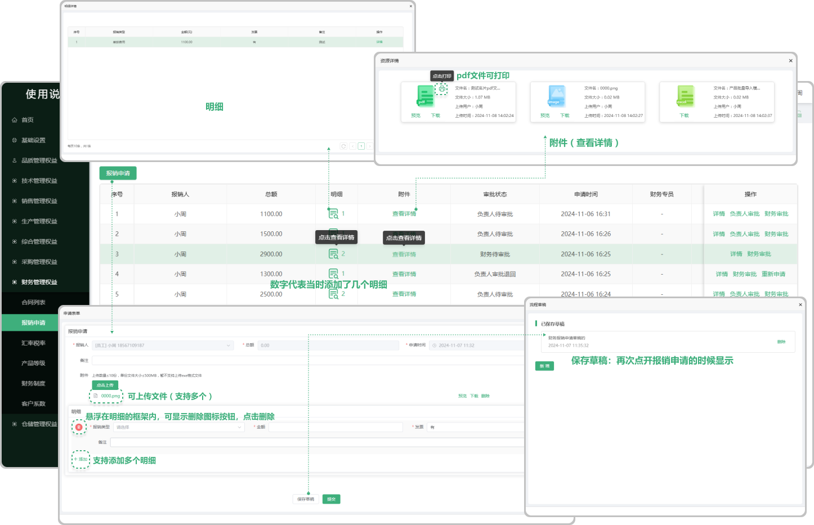
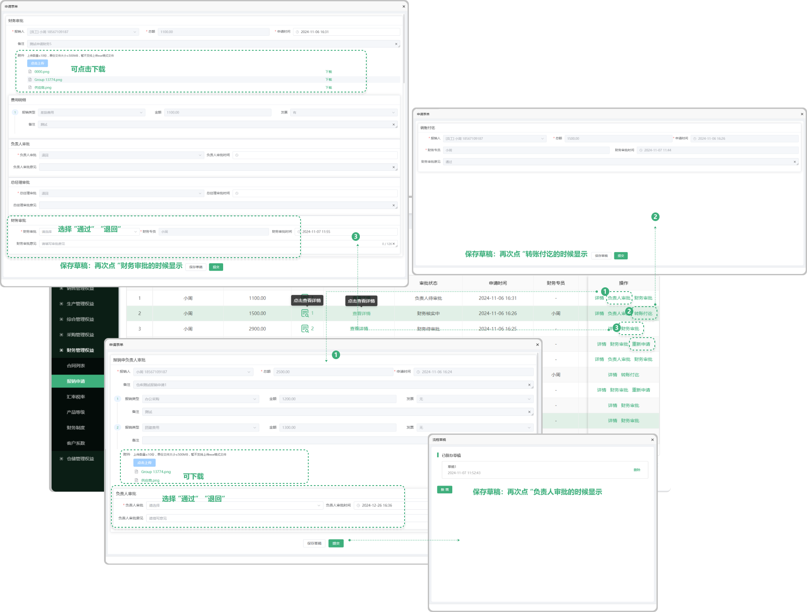

# 报销申请

> "报销申请列表"位于财务管理板块，在"报销申请列表中，可新增报销单子，新增完成以后，页面的操作区域出现：详情、负责人审批、财务审批，同时支持查看明细、附件

#### 1. 新增报销申请

* 点击报销申请按钮可新增申请表单

  -可一次性上传多个报销类型的申请

  -在报销申请中可以点击上传附件，（可上传多个附件（支持删除、下载、预览）

#### 2.保存草稿功能、

* 可存为草稿，再次打开新增报销申请时显示之前所存的草稿

#### 3.明细

* 点击明细可查看这条报销数据单的报销明细

  -数字代表这个数据单中有多少个报销类型

#### 4.附件

*点击查看详情文字可查看当时新增报销申请时上传的文件（支持预览、下载、pdf打印）

#### 5.审批

* 分为负责人审批和财务审批

  -点击负责人审批，需要负责人进行审批(分为 “通过”  和  “退回”，如果退回需要重新发起审批 )，审批中支持下载附件，可保存草稿（保存的草稿会在您再次点击这条数据的 “负责人审批“ 时出现）

  -点击财务审批，需要财务进行审批(分为 “通过”  和  “退回”，如果退回需要重新发起审批 )，审批中支持下载附件，可保存草稿（保存的草稿会在您再次点击这条数据的 “财务审批“ 时出现）

#### 6.重新发起

* 如果负责人审批或财务审批的时没有通过，则被退回来，需要重新发起

 -在原来编辑的基础上重新发起

#### 7.转账乞讨

* 在负责人和财务人员审批完成后，会进行最后的审批-转账乞讨

  -发起方已经完成了支付，而接收方已经收到相应的款项。这一状态表明资金已经离开发起方的账户，并进入接收方的控制范围，且双方都已确认了资金的正常到账

