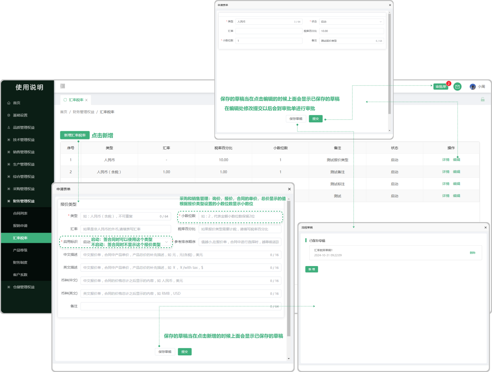

# 汇率税率

> "汇率税率列表"位于财务管理板块，在"汇率税率列表"中新增相对应的"报价类型" 支持编辑更改 ，在新增合同的时候会用到报价类型

#### 1. 如图所示：
* 新增汇率税率：点击新增可以新增 ”报价类型“ 
* 保存草稿：当在新增和编辑时所保存的草稿等再次打开新增和编辑的时候会显示
* 编辑：在编辑处修改的信息提交以后会传到审批单进行审批
* 启动标识：如果选择 ”启动“在新增合同的时可以使用报价类型。选择 "不启动” 的时候在新增合同的时不显示这个报价类型

