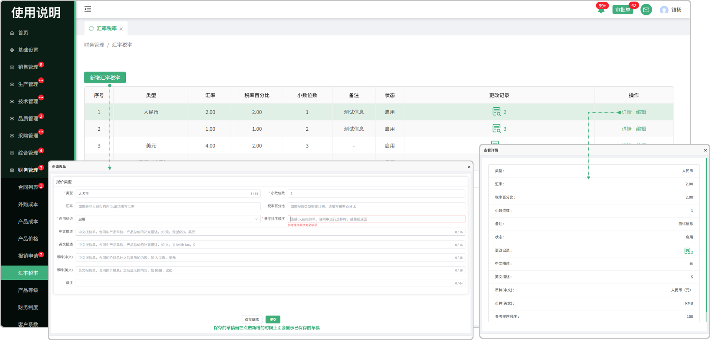
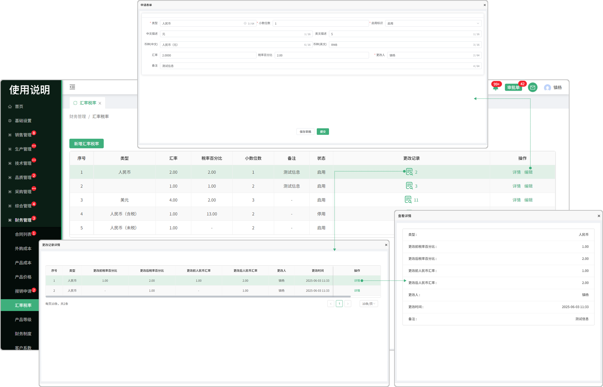

# 汇率税率

> "汇率税率列表"位于财务管理板块，在"汇率税率列表"中新增相对应的"报价类型" 支持编辑更改 ，在新增合同的时候会用到报价类型

#### 1. 新增汇率税率

* 点击新增可以新增 "报价类型"

   -小数位数：采购和销售管理：询价，报价，合同的单价，总价显示的值，根据报价类型设置的小数位数显示小数位

     （例如：报价类型设置的小数位数是2位，产品列表中单价，总价显示的金额位数是2位）

   -启用时在新增合同时可以使用报价类型

   -不启用时在新增合同时不显示这个报价类型

#### 2.保存草稿功能、

* 可存为草稿，再次打开新增时显示之前所存的草稿

### 3.详情

* 点击详情可查看报价的类型，汇率，税率百分比，小数位数，备注，状态，更改记录，中文描述，英文描述，中/英文币种，参考排序值顺序

#### 4.更改记录

* 在编辑中更改了信息提交后，生成更改记录，点击可查看更改前/更改后的信息

#### 5.编辑功能

* 可在原来基础的信息上去编辑更改

