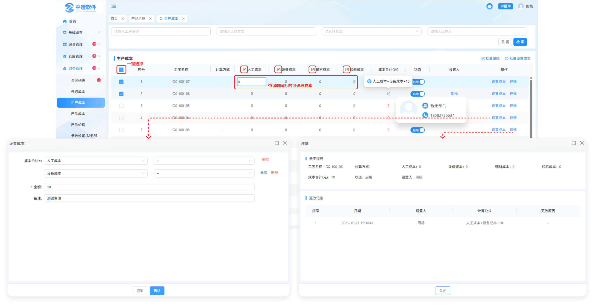
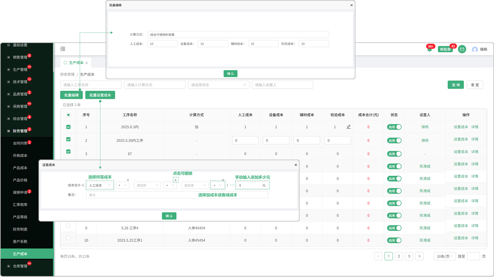

# 生产成本

> "生产成本列表"位于财务管理板块，在生产成本列表中可设置相对应的成本

#### 1.编辑成本

* 带有编辑图标的字段属于可编辑字段，（人工成本，设备成本，辅材成本，检验成本），下方相对应的表字段中，默认是0，可点击编辑成本

#### 2.状态

* 启用代表可以使用，停用代表不可使用

#### 3. 设置成本

* 点击设置成本按钮可设置成本

  -选择成本（人工成本,设备成本，辅材成本，检验成本）

  -点击新增图标可添加新的选择框

  -可选择加某成本或减某成本

  -最后可手动输入自定义钱数

#### 4.详情

* 点击详情可查看基本信息和更改记录

* 如果更改了成本设置，会产生记录到详情中查看

#### 5.设置人

* 设置完成本后，页面显示设置人员，点击人员名称可查看人员的基础信息（部门，电话）

#### 6.批量编辑

* 先勾选序号前的勾选框，点击批量设置按钮可设置所选产品的成本

#### 7.批量设置成本

* 先勾选序号前的勾选框，点击批量设置按钮可设置所选产品的成本

  -选择成本（人工成本,设备成本，辅材成本，检验成本）

  -点击新增图标可添加新的选择框

  -可选择加某成本或减某成本

  -最后可手动输入自定义钱数

