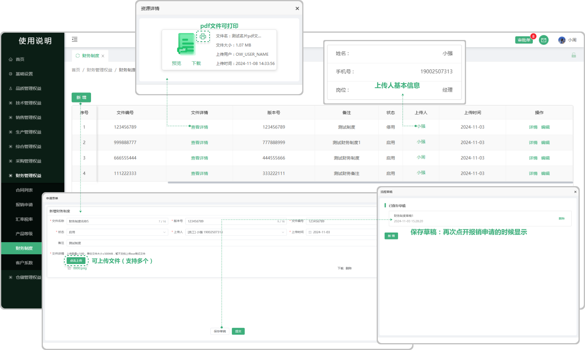

# 财务制度

> "财务制度列表"位于财务管理板块，在"财务制度列表中可新增相对应的"制度" 可编辑

#### 1. 如图所示：
* 新增：在采购制度列表中可新增采购的制度（可上传多个文件、选择上传时间、上传人)
* 保存草稿 : 点击保存草稿后,再次点击新增的时候会显示之前保存的草稿
* 文件详情：在财务制度列表中新增制度时上传的文件 
* 上传人：点击人员可查看相对应人员的基本信息
* 详情：可查看当时所上传制度的信息
* 编辑：可以修改之前所新增的制度

