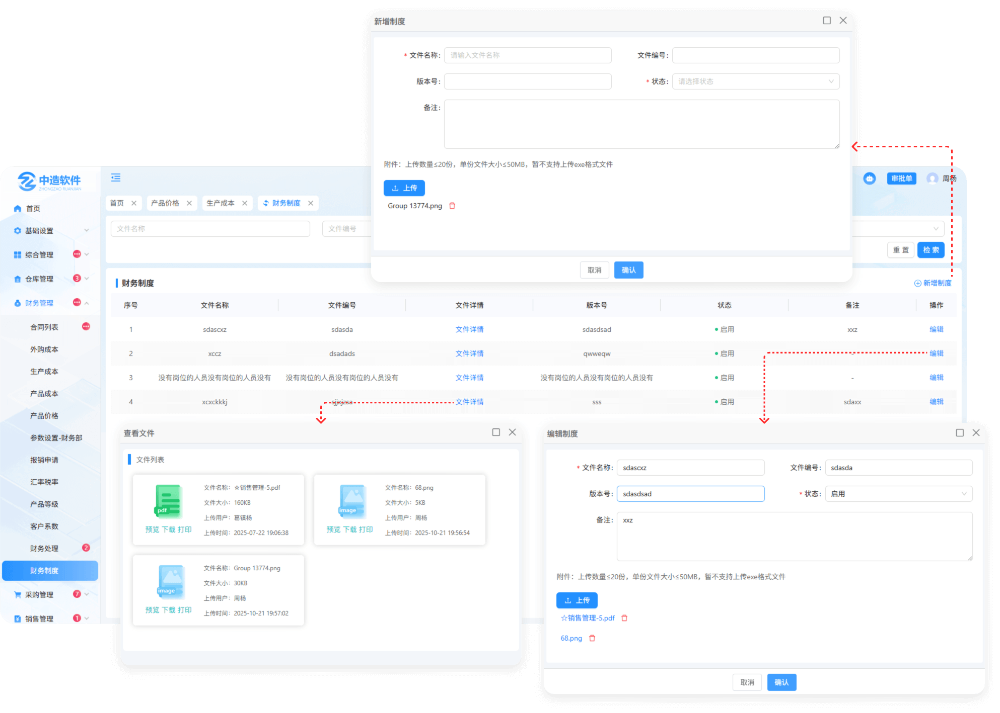

# 财务制度

> "财务制度列表"位于财务管理板块，在"财务制度列表中可新增相对应的"制度" 可编辑

#### 1. 新增制度
* 点击新增制度按钮可新增相对应的财务制度（可上传多个文件）

  -状态分为启用/停用，启用的可以使用该制度，停用时不可使用

#### 2.保存草稿功能

* 可存为草稿，再次打开新增时显示之前所存的草稿

#### 3.文件详情

* 新增制度时上传的文件，点击可查看全部（支持下载、打印）

#### 4.编辑功能

可修改之前所新增的制度（可保存草稿箱）

