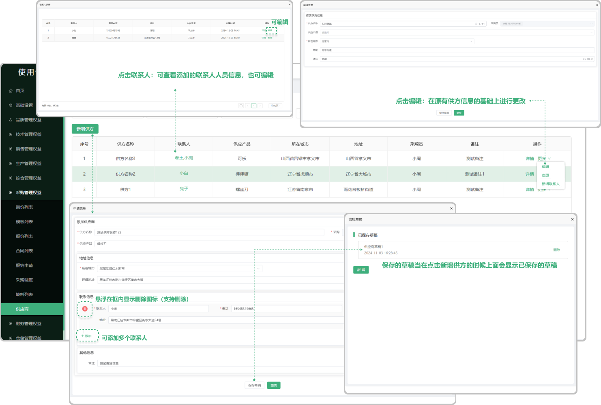
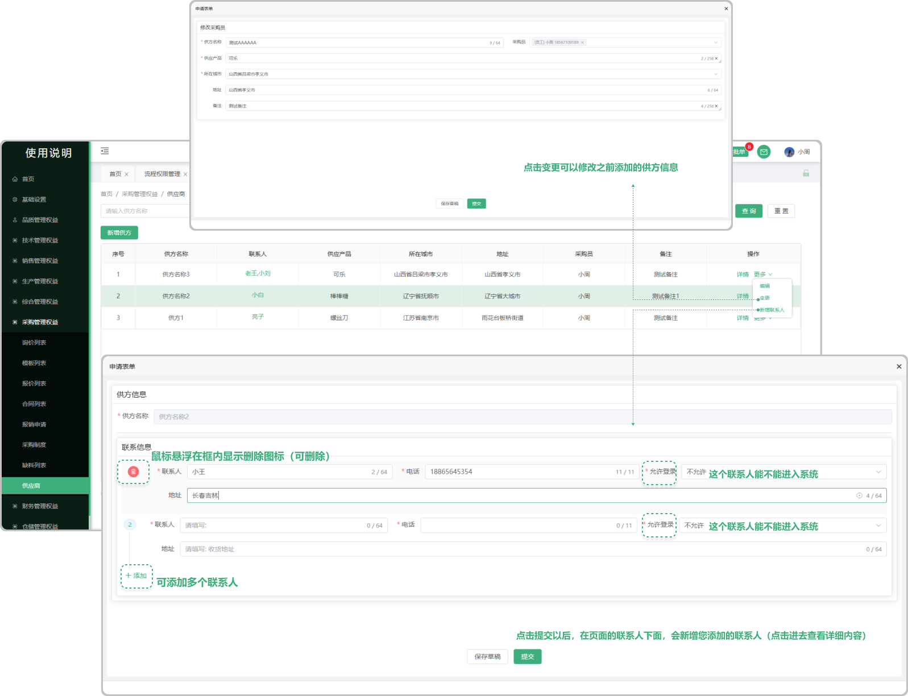

# 供应商

> "供应商列表"位于采购管理板块，在"供应商列表中可新增相对应的"供方" 信息，新增的供方信息支持编辑、更改、新增联系人（在采购管理的合同列表和模板列表需用到供方的信息）

#### 1. 如图所示：
* 新增供方：点击跳出弹窗添加供方的信息资料，支持添加多个联系人，鼠标悬浮在联系人框内显示删除图标，填完信息点击保存即可
* 草稿：再次新增供方信息的时候，点击进去显示之前所保存的草稿
* 编辑：可以修改之前所新增的供方

#### 2. 如图所示：
* 变更：可以修改之前所新增的供方
* 新增联系人：可以在之前所编辑的供方信息基础上去新增联系人（支持多个）添加完成以后在界面对应的联系人可看到新增的联系人信息（点击查看详情）

