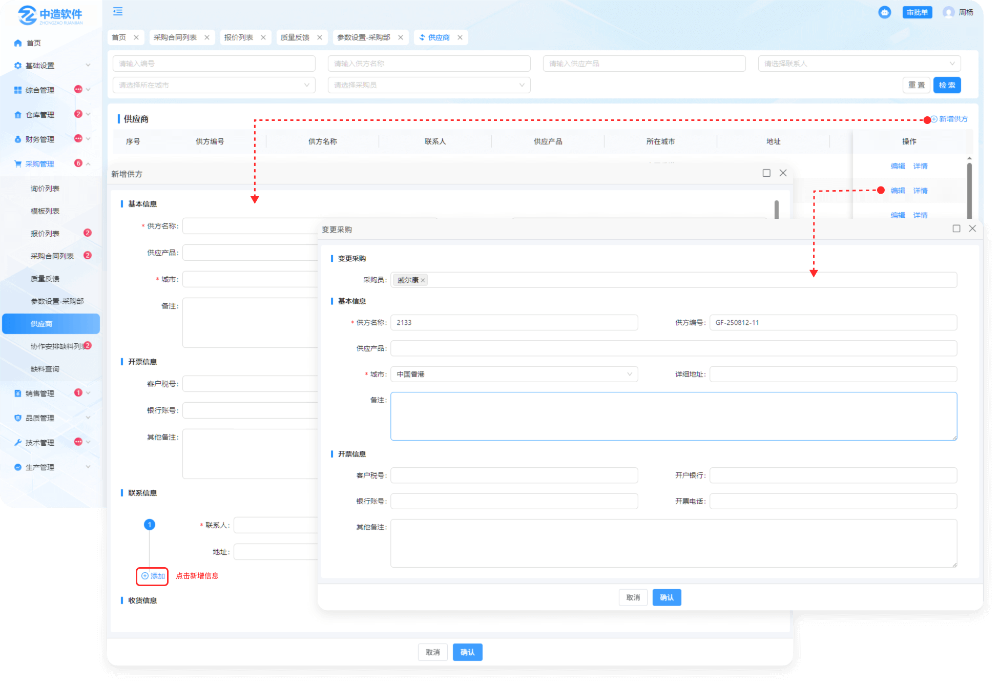
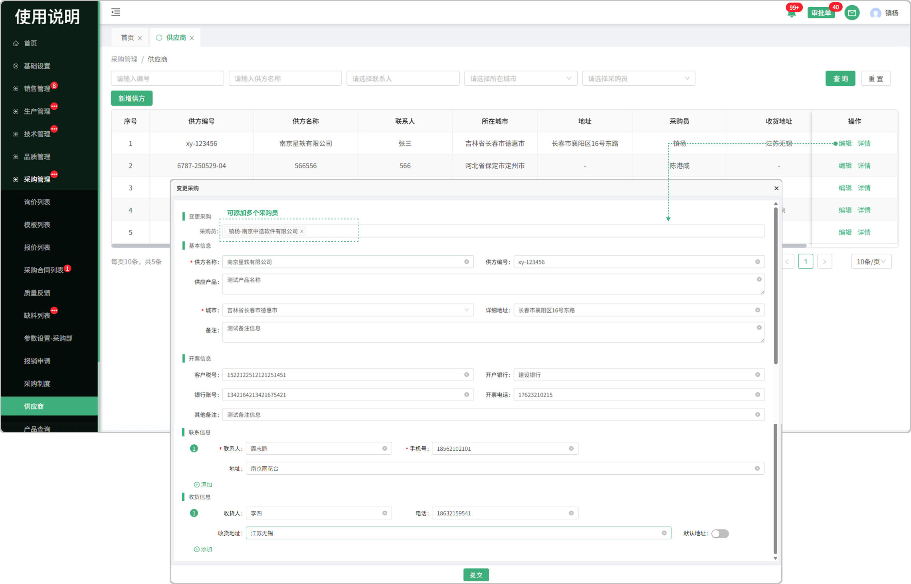

# 供应商

> "供应商列表"位于采购管理板块，在"供应商列表中可新增相对应的供方信息，新增的供方信息支持编辑

#### 1.新增供方
* 点击新增按钮可添加供应商信息
* 联系人信息：可添加多个联系人信息
* 收货人信息：可添加多个收货人信息

  -默认地址：如果添加了多个收货信息可设置默认地址

#### 2.编辑功能

* 可在原有的供方信息上进行修改

* 变更采购：支持添加多个采购人员

#### 3.详情

* 点击详情按钮可查看供方的基本信息，公司名称变更记录，地址详情

* 如果在编辑时，更改了供方名称提交后，详情里面记录更改前的名称，更改后的名称，更改人，更改时间

