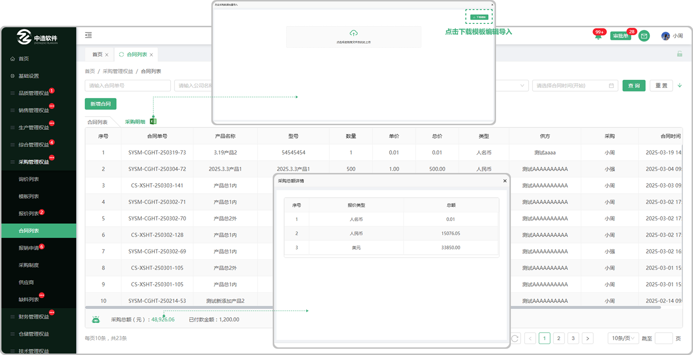

# 合同列表

> "合同列表“位于"采购管理板块，在"合同列表"中新增 "合同单" 可查看详情、添加收款、提交发票

#### 1.新增合同
* 新增合同的方式 

  -直接新建采购合同，合同信息由采购人员编辑

  -将报价单转为合同，信息由采购人员编辑

#### 2.详情

* 详情-生成二维码

-合同签署后，页面详情会生成二维码，通过用户端app可以进行扫码，查看合同信息

-管理员和超级管理员：扫码操作查看的二维码信息是合同的时间轴信息

-普通人员:扫码操作查看的是合同详情界面

-普通人员查看权限：部门负责人可以扫码查看部门下所有人员的合同信息

-部门成员只能扫码查看自己的合同详情信息

#### 3.收货

*  当销售方和采购方均是系统内的企业时，对方发货后采购合同显示收货按钮

* 点击收货按钮，填写收货量、送检量、需求完成时间

  -采购所签合同时填写的内部型号如果有质检项，收货时可送检（所送检的产品将到入场检主任列表中由主任进行分发检验

  -也可不送检直接签收到入库列表中进行入库

  

#### 2. 删除功能
*  直接新建的合同，如果在新建完成，发现合同信息有误，可以点击删除，类似于撤回的动作

* 接收到报价单转入的合同无法删除

#### 3.合同状态：
* 已签章：（深色代表双方都签章，浅色代表只有一方签章）
* 未签章：在合同页面新增的合同没签章之前可以删除，报价单流转过来的合同不支持编辑

#### 4："添加收款"

* 点击添加收款跳出弹窗，在弹窗里面可以看到已添加的收款信息，可以再次添加，输入收款金额、备注、点击确认（系统会查询到与该客户另外的合同，在表单里面也可以继续添加收款）

#### 5："添加状态"

* 分为  ”确认中“ ”已确认“   ”退回“ 指的是当添加收款信息以后，需要在财务部门的合同列表中确认收款信息
  -确认中：如果没得到确认就显示 ”确认中“

-已确认：如果确认同意了显示 ”已确认“

-退回：如果退回了显示 ”退回“ （退回会有标记退回的原因，可修改在次提交）

#### 6."提交发票"

* 提交发票：点击提交发票跳出弹窗，在弹窗里面可以看到已添加的发票信息，可以再次添加，输入发票金额、备注、点击确认（系统会查询到与该客户的另外合同，在表单里面也可以继续提交发票）

#### 7."发票状态"

* 分为 ”确认中“  ”已确认“   ”退回“ 指的是当申请发票以后，需要在财务部门的合同列表中确认申请发票的信息
  -确认中：如果没得的确认就显示 ”确认中“

-已确认：如果确认同意了显示 ”已确认“

-退回：如果退回了显示 ”退回“ （退回会有标记退回的原因，可修改在次提交）

#### 8.合同详情

* 供方信息：来源于采购管理,供应商列表中添加的客户信息

  -显示关联图标的代表这个公司有关联的子公司

* 关联公司：供需方可以通过下拉框选择关联公司，同时会根据选择的关联公司，进行信息的更换。

  —使用关联公司时，进行签章时印章使用的为关联公司印章。（关联公司印章也需要设置后对人员进行授权）

* 供方联系人:采购管理,来源于供应商列表中添加了联系人
* 类型:来源于财务管理,汇率税率列表中添加的汇率税率信息
* 语言:可选中文和英文
* 选择产品::产品来源于所添加供应商公司的产品列表中的产品（可以输入型号创建产品字段）
* 批量导入：可批量导入产品（先下载模板Excel进行编辑导入即可）
* 小眼睛图标：指的是页面中在甲乙方列表中的小眼睛图标，默认全展示，可关闭或者打开（如果关闭对方将无法看到这条信息，包括打印和下载都不展示）
* 小笔图标：文字后面显示小笔图标的字段均可编辑
* 使用提示：点击使用提示可弹出弹窗，在弹窗中显示动图，可切换查看对应功能的使用（新增字段、批量修改价格、调整宽度、签章显示、签章不显示）
* 内部型号：点击搜索图标弹出弹窗选择内部所要对应的型号
* 历史报价:跟这个公司销售过这个产品，如果再次报价就会有之前的报价信息
* 历史成交价:跟这个公司销售过这个产品,成功了以后再次销售会有之前的历史成交价
* 单价/总计小数点位数显示：根据报价类型设置的小数位数显示小数位

  -（例如：报价类型设置的小数位数是2位，产品列表中单价，总价显示的金额位数是两位）

  -（报价类型设置的小数位数是4位，产品列表中单价，总价显示的金额位数是4位）
* 总计:是所添加的产品单价的总计(支持更改单价添加公式(加 , 减 , 乘(乘的是百分比也就是0.01) 输入数值)
* 字段更改:在添加产品信息以后可以悬浮对应的产品信息如果出现"更改的图标"就代表可以更改这个产品内容的信息,或者出现时双击也可以更改
* 合同附件：点击可上传合同附件
* 抄送：下方文本框内所填写的信息会发送给所勾选的抄送对象
* 存为模板:如果点击存为模板在模板列表中展示所存的模板
* 签章:如果点击签章在选择合同章确认以后,在合同列表显示，（签章之前需填写交货时间 )
* 保存:点击保存,在合同列表显示状态为 "未签章"，点击详情可进去签章

#### 9. 保存功能
* 编辑合同信息的时候，可以将合同暂存下来， 状态是未签章

#### 10. 存为模板功能
* 把 合同信息中， 存成模板，供后续使用

#### 11. 合同附件功能
* 在签章前，可以上传一些允许被客户浏览的文件

#### 12. 签章功能
* 可编辑的合同，合同信息拟定完毕后，可以同步发送给客户查看， 状态是已签章， 客户查看合同的方式包括：

  -使用系统的客户 ，可以登录自身系统，浏览合同，退回合同，签章

  -不使用系统的客户，可以登录航舰系统，浏览合同，退回合同，签章

* 接收到的，来自客户拟定好的合同，核对合同信息无误后，可以签章

# 采购明细
> 可在 “采购合同”列表切换 “采购明细”, 采购人员能够从多维度查看历采购产品的信息数据，支持合同单号，公司名称，产品型号等多维度进行数据筛选。

#### 1.采购明细

* 采购明细列表查询：支持合同单号，公司名称，产品名称，型号规格，采购人员，合同签署时间

* 数据来源：已签章完成的合同会生成采购明细

* 采购总额：显示采购的总金额，点击可查看采购总额的详情
  -超级用户/管理员 能查看所有数据

  -部门负责人岗位的人员，查看部门下所有人员的数据

  -非部门负责人岗位的人员，查看自己的数据

* 已收款金额：显示已经收款的金额

* 采购明细数据记录和删除

  -采购方签章后，生成采购记录

  -销售方管理员点击合同作废后，删除采购方对应合同的明细记录

  -销售方取消后，删除销售方该合同的明细记录

  -销售方退回后，删除采购方该合同的明细记录

  -临时客户退回后， 删除 采购方 针对该合同 的 价格记录。（临时客户: 未使用用户端系统，但对方联系人允许登录销售方系统的人员）

#### 2.批量导入

* 1.点击批量导入，先下载模板（注意下载的模板只适用于批量导入采购明细里面上传的模板)
* 2.点开下载的模板进行编辑（编辑时请阅读表格上面的提示文案，以防导入时出现错误，从而无法导入）
* 3.点击或者拖拽所保存的模板（只有在采购明细列表的批量编辑中下载的模板才能上传，其他无效）进行上传
* 4.上传成功会弹出显示上传的数据，可选择性导入或者一键导入（如果无法导入，请滑动到页面最后，查看提示信息，可能存在编辑时出现的错误，需从新更改再次上传）

