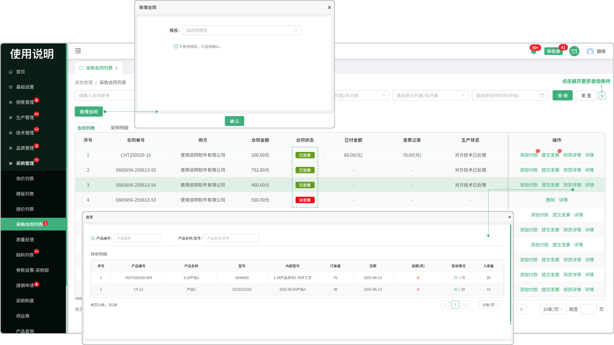
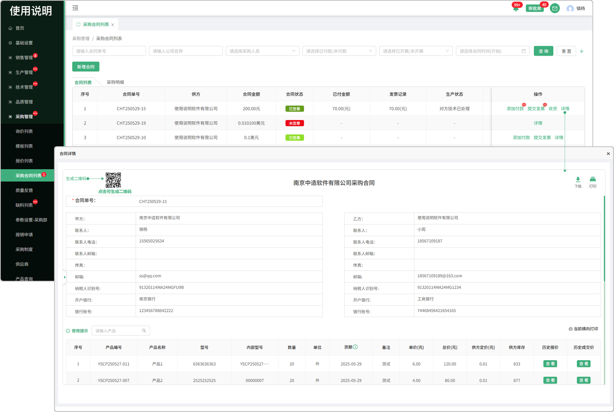
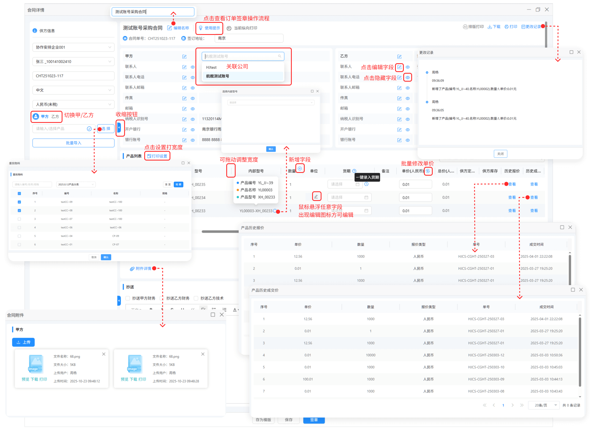
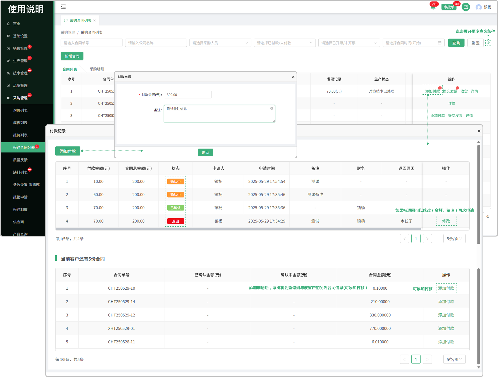
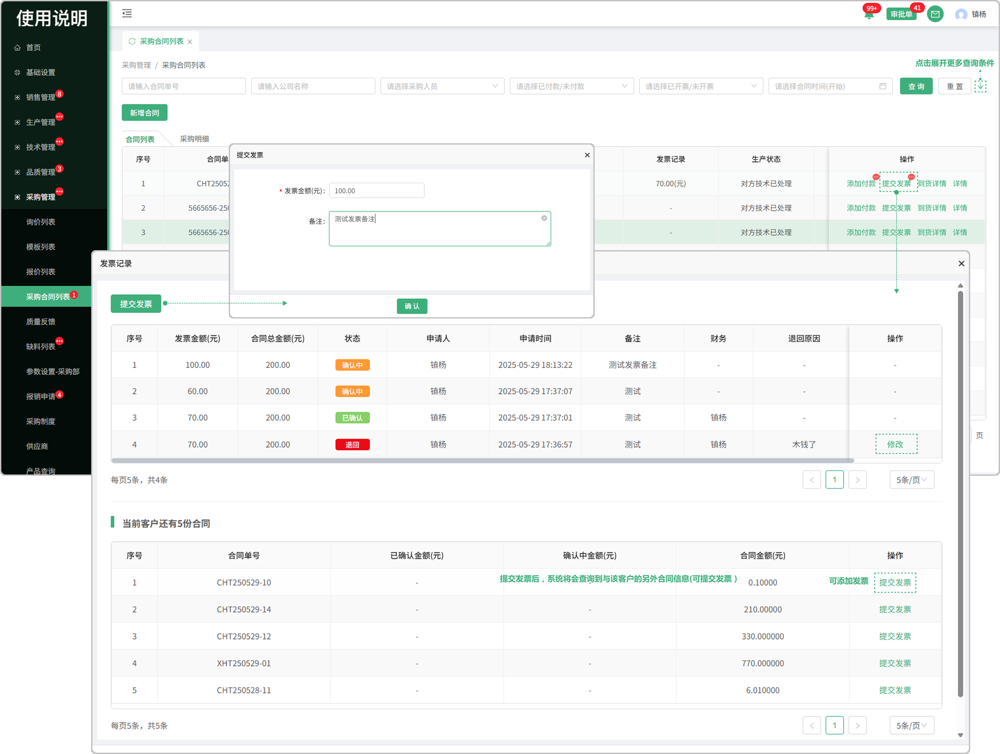
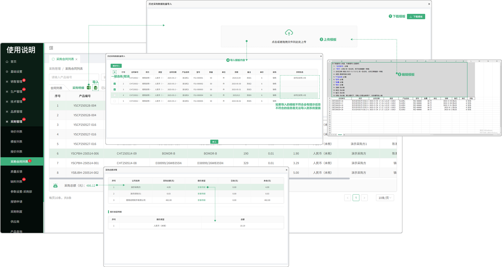

# 合同列表

> "合同列表“位于"采购管理板块，在"合同列表"可维护相对应的合同单，可添加收款，提交发票，收货，查看详情

#### 1.新增合同
* 新增合同的方式 

  -直接新建采购合同，合同信息由采购人员编辑

  -将报价单转为合同，信息由采购人员编辑

#### 2.收货

* 当销售方和采购方均是系统内的企业时，对方发货后采购合同显示收货按钮

* 点击收货按钮，填写收货量、送检量、需求完成时间

  -可一键点击设置收货量

  -采购所签合同时填写的内部型号如果有质检项，收货时可送检（所送检的产品将到入库检安排列表中由主任进行分发检验

  -也可不送检直接签收到入库列表中进行入库

#### 3. 删除功能
* 未签章的合同支持删除
* 报价单转入的合同无法删除

#### 4.合同状态：
* 已签章：（深色代表双方都签章，浅色代表只有一方签章）
* 未签章：在合同页面新增的合同没签章之前可以删除，报价单流转过来的合同不支持删除

#### 5.详情

* 生成二维码

  -合同签署后，页面详情会生成二维码，通过用户端app可以进行扫码，查看合同信息

  -管理员和超级管理员：扫码操作查看的二维码信息是合同的时间轴信息

  -普通人员:扫码操作查看的是合同详情界面

  -普通人员查看权限：部门负责人可以扫码查看部门下所有人员的合同信息

  -部门成员只能扫码查看自己的合同详情信息

#### 6.新增合同详情

* 乙方信息：来源于采购管理,供应商列表中添加的客户信息

  -显示关联图标的代表这个公司有关联的子公司

* 关联公司：供方/需方可通过下拉框选择关联公司，同时会根据选择的关联公司，进行信息的更换

  -使用关联公司时，签章时所用的印章为关联公司印章。（关联公司印章也需要设置后对人员进行授权）

* 乙方联系人 : 来源于供应商列表中添加的联系人(可添加多个联系人)
* 语言:可选择中文/英文
* 类型 : 来源于财务管理,汇率税率列表中添加的汇率税率信息
* 选择产品 : 产品来源于所添加甲方公司产品列表中的产品（可输入产品点击"对号"图标创建产品字段）
* 批量导入：可批量导入产品（先下载模板Excel进行编辑导入即可）
* 产品查询：支持查询已添加的产品信息
* 批量删除：勾选序号前的勾选框方可批量删除已添加的产品，或点击删除图标单独删除
* 小眼睛图标：指的是页面中需方/供方列表中的小眼睛图标，默认全展示，可选择关闭或者打开（如果关闭对方将无法看到这条信息，包括打印和下载都不展示）
* 小笔图标：文字傍边带有小笔图标的方可编辑
* 下载图标：点击下载图标可下载当前页面内容
* 打印图标：点击可打印当前页面的信息
* 使用提示：点击使用提示可弹出弹窗，在弹窗中显示动图，可切换查看对应功能的使用（新增字段，批量修改价格，调整宽度，签章显示，签章不显示）
* 货期：点击选择货期时间，不添加在签章时会提醒
* 内部型号：点击选择内部型号（选择自己公司对应的产品，物料）
* 历史报价 : 跟同个公司询价过同个产品时，如果再次询价就会显示之前的产品历史报价信息
* 历史成交价 : 跟同个公司成交过这个产品，成功以后再次询价时会显示之前的产品历史成交价
* 单价/总计小数点位数显示：根据汇率税率列表中设置的小数位数显示小数位数

  -（例如：设置的小数位数是2位，产品列表中单价，总价显示的金额位数是两位）

* 总计 : 是所添加的产品单价的总计(支持更改单价添加公式(加 , 减 , 乘(乘的是百分比，1就是0.01) 输入数值)
* 字段更改 : 在添加产品信息以后可以悬浮对应的产品信息如果出现"更改的小笔图标"就代表可以更改这个产品的信息内容,或者双击也可以更改
* 合同附件：点击可上传合同附件，支持删除/下载
* 抄送：下方文本框内所填写的信息会发送给所勾选的抄送对象

  -文本框所编辑的条款需要使用时记得勾选条款前面的勾选框才能显示出来

* 存为模板 : 如果点击存为模板在模板列表中显示所存的模板
* 签章：如果点击签章在选择合同章确认以后,在合同列表显示，（签章之前需填写货期）
* 保存：点击保存,在合同列表显示状态为 "未签章"，点击详情可进去签章

  -编辑合同信息的时候，可以将合同暂存下来， 状态是未签章

#### 7.添加付款

* 点击添加付款，在弹窗里面可以看到已添加的付款信息，可以再次添加，输入付款金额、备注、点击确认（系统会查询到与该客户另外的合同，在表单里面也可继续添加付款）

#### 8.付款状态

* 分为：确认，已确认，退回，指的是当添加付款信息以后，需要在财务部门的合同列表中确认收款信息
  
  -确认中：如果财务没有得到确认就显示 确认中

  -已确认：如果财务确认同意了显示 ”已确认“

  -退回：如果财务退回了显示 ”退回“ （退回会有标记退回的原因，可修改在次提交）

#### 9.提交发票

* 提交发票：点击提交发票，在弹窗里面可以看到已添加的发票信息，可以再次添加，输入发票金额，备注，点击确认（系统会查询到与该客户的另外合同，在表单里面也可以继续提交发票）

#### 10.发票状态

* 分为:确认中，已确认，退回，指的是当申请发票以后，需要在财务部门的合同列表中确认申请发票的信息

  -确认中：如果财务没得到确认就显示 ”确认中“

  -已确认：如果确认同意了显示 ”已确认“

  -退回：如果退回了显示 ”退回“ （退回会有标记退回的原因，可修改在次提交）

# 采购明细
> 可在 “采购合同”列表切换 “采购明细”, 采购人员能够从多维度查看历史采购产品的信息数据

#### 1.采购明细

* 采购明细列表查询：支持产品编号，合同单号，公司名称，产品/型号，采购员，合同时间等多维度进行数据筛选

* 数据来源：已签章完成的合同会生成采购明细

* 采购总额：显示采购的总金额，点击可查看采购总额的详情

  -超级用户/管理员 能查看所有数据

  -部门负责人岗位的人员，查看部门下所有人员的数据

  -非部门负责人岗位的人员，查看自己的数据

* 已付款金额：显示已经付款的金额
* 未付款金额：显示未付款的金额
* 采购明细数据记录和删除

  -采购方签章后，生成采购记录

  -销售方管理员点击合同作废后，删除采购方对应合同的明细记录

  -销售方取消后，删除销售方该合同的明细记录

  -销售方退回后，删除采购方该合同的明细记录

  -临时客户退回后， 删除 采购方 针对该合同 的 价格记录。（临时客户: 未使用用户端系统，但对方联系人允许登录销售方系统的人员）

#### 2.批量导入

* 1.点击批量导入，先下载模板（注意下载的模板只适用于批量导入采购明细里面上传的模板)
* 2.点开下载的模板进行编辑（编辑时请阅读表格上面的提示文案，以防导入时出现错误，从而无法导入）
* 3.点击或者拖拽所保存的模板（只有在采购明细列表的批量编辑中下载的模板才能上传，其他无效）进行上传
* 4.上传成功会弹出显示上传的数据，可选择性导入或者一键导入（如果无法导入，请滑动到页面最后，查看提示信息，可能存在编辑时出现的错误，需从新更改再次上传）

* #### 3.导出

* 先点击导出图标，触发勾选框

  -可手动输入n条导出，或手动勾选导出

