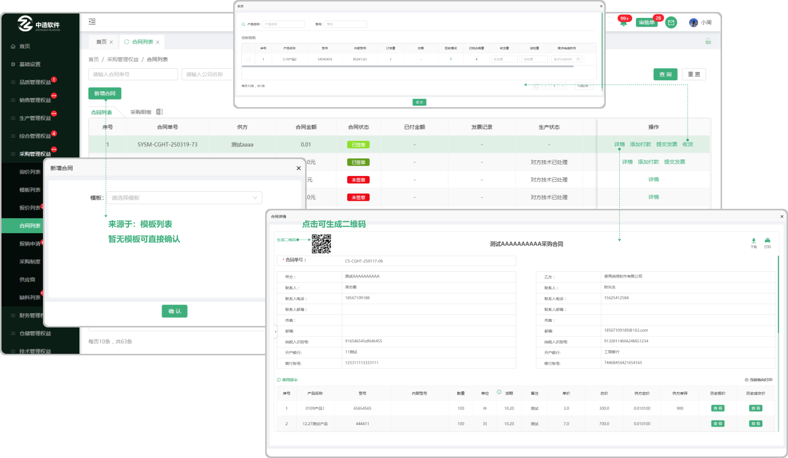
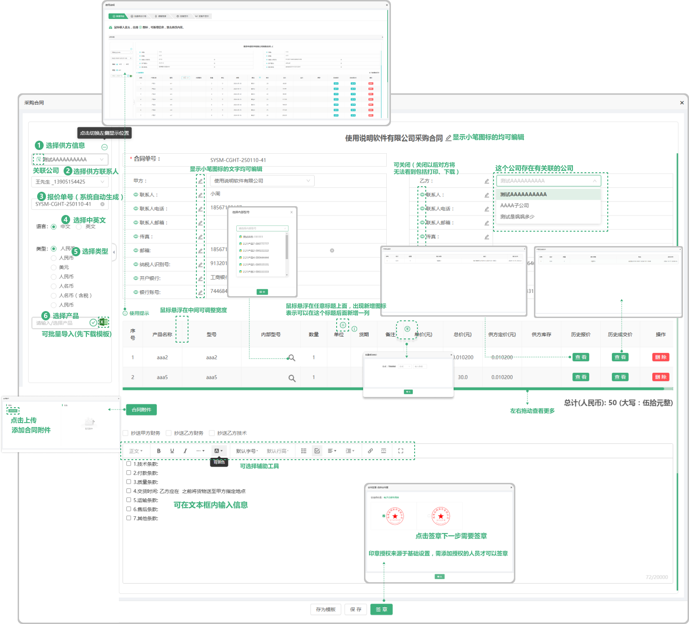
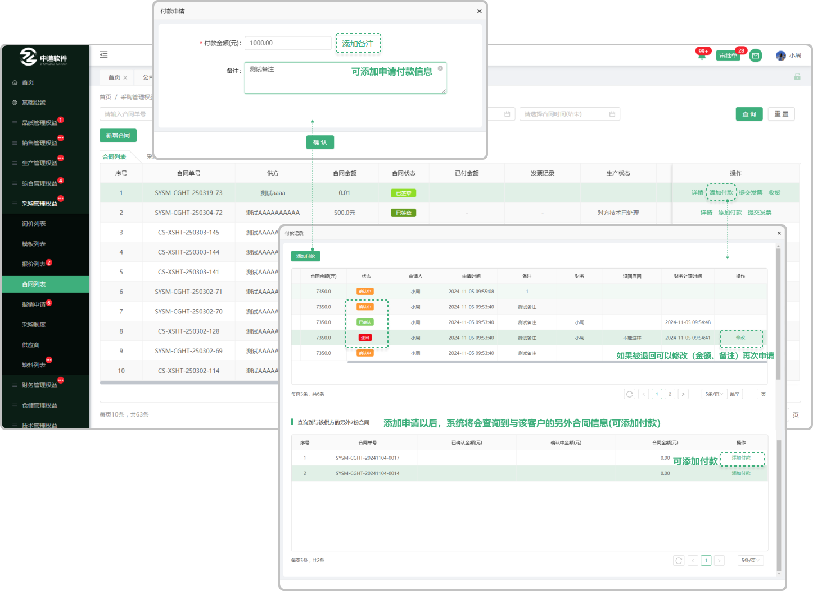

# 合同列表

> "合同列表“位于"采购管理板块，在"合同列表"中新增 "合同单" 可查看详情、添加收款、提交发票

#### 1. 如图所示：

* 新增合同单：点击新增报价单选择模板（也可不选择直接进入合同单签署）
* 报检单状态：分为”已签章“   “未签章”
* 未签章：在合同列表点击新增合同进入页面编辑完点击“保存”情况下是未签章（可以删除）
* 已签章：在合同列表页面点击新增合同进入合同页面编辑完点击签章以后见面显示已签章 2.在未签章情况下点击详情进入合同页面点击签章页面显示“已签章”，已签章的情况下支持添加收款、提交发票

#### 2. 如图所示："新增合同单"

* 供方信息:来源于采购管理,供应商列表中添加的客户信息
* 供方联系人:采购管理,来源于供应商列表中添加了联系人(可添加多个联系人)
* 类型:来源于财务管理,汇率税率列表中添加的汇率税率信息
* 语言:可选中文和英文
* 选择产品::产品来源于所添加供应商公司的产品列表中的产品（可以输入型号创建产品字段）
* 批量导入：可批量导入产品（先下载模板Excel进行编辑导入即可）
* 历史报价:跟这个公司销售过这个产品，如果再次报价就会有之前的报价信息
* 历史成交价:跟这个公司销售过这个产品,成功了以后再次销售会有之前的历史成交价
* 总计:是所添加的产品单价的总计(支持更改单价添加公式(加 , 减 , 乘(乘的是百分比也就是0.01) 输入数值)
* 字段更改:在添加产品信息以后可以悬浮对应的产品信息如果出现"更改的图标"就代表可以更改这个产品内容的信息,或者出现时双击也可以更改
* 交货时间：位于合同的条款下面，双击在乙方“____”之前将货物送到......
* 存为模板:如果点击存为模板在模板列表中展示所存的模板
* 签章:如果点击签章在选择合同章确认以后,在合同列表显示，（签章之前需填写交货时间 )
* 保存:点击保存,在合同列表显示状态为 "未签章"，点击详情可进去签章

#### 3. 如图所示："添加收款"

* 添加收款：点击添加收款跳出弹窗，在弹窗里面可以看到已添加的收款信息，可以再次添加，输入收款金额、备注、点击确认（系统会查询到与该客户另外的合同，在表单里面也可以继续添加收款
* 收款状态：分为 ”确认中“  ”已确认“   ”退回“ 指的是当添加收款信息以后，需要在财务部门的合同列表中确认收款信息，如果没得到确认就显示 ”确认中“ 如果确认同意了显示 ”已确认“ 如果退回了显示 ”退回“ （退回会有标记退回的原因，可修改在次提交）

#### 4 . 如图所示："提交发票"

* 提交发票：点击提交发票跳出弹窗，在弹窗里面可以看到已添加的发票信息，可以再次添加，输入发票金额、备注、点击确认（系统会查询到与该客户的另外合同，在表单里面也可以继续提交发票
* 发票状态：分为 ”确认中“  ”已确认“   ”退回“ 指的是当申请发票以后，需要在财务部门的合同列表中确认申请发票的信息，如果没得的确认就显示 ”确认中“ 如果确认同意了显示 ”已确认“ 如果退回了显示 ”退回“ （退回会有标记退回的原因，可修改在次提交）

