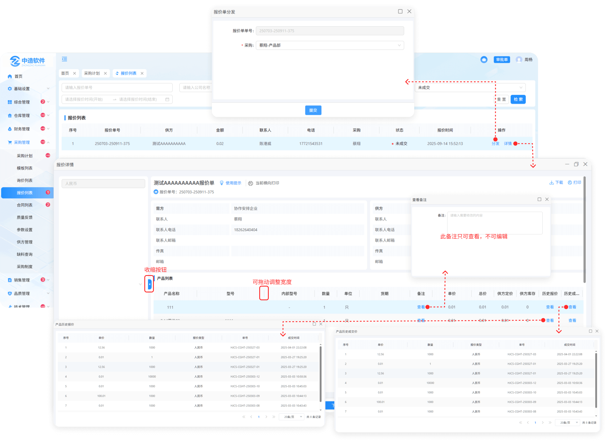

# 报价列表

> "报价列表”位于采购管理板块，在"报价列表"中可查看所有报价的信息（来源于供方在销售板块的”报价列表”中与需方公司新增的报价信息

#### 1. 状态提示

* 未成交：只是报价完成，没有在转换为合同情况下显示 "未成交"

  -下单/退回以后报价单清除

#### 2.分发

* 分发给某个采购（支持再次分发）

#### 3.报价详情

* 备注：点击备注按钮可查看备注信息（只能查看不可编辑）

* 历史报价：跟这个公司销售过这个产品，如果再次报价就会有之前的报价信息

* 历史成交价：跟这个公司销售过这个产品,成功以后再次销售会有之前的历史成交价

* 下单：未成交的情况下点击详情会显示下单按钮，点击可转换到签署合同界面(可签署成合同)

* 退回：可退回销售方发起的报价单

