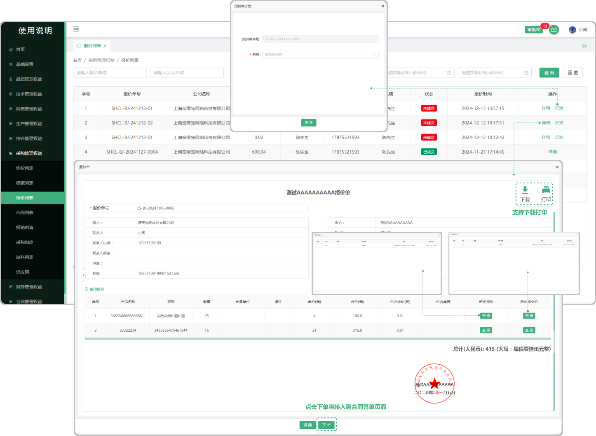

# 报价列表

> "报价列表”位于采购管理板块，在 "报价列表" 中可查看所有报价的信息（来源于需方在采购板块的”询价列表”中与供方公司新增的询价信息，分为（已成交、未成交），取决于供方的销售部“询价列表中”进行转为报价单以后显示 "未成交"（需要在供方的销售部 ”报价列表中点击详情里面转化为合同以后，或者在需方采购部 “报价列表详情中下单（转为合同）以后显示 ”已成交“）

#### 1. 如图所示：
* 未成交：只是报价完成，没有在转换为合同情况下显示 "未成交"
* 已成交：需要在供方的销售部 ”报价列表中点击详情里面转化为合同以后，或者在需方采购部 “报价列表详情中下单（转合同）以后显示 ”已成交“
* 历史报价：跟这个公司销售过这个产品，如果再次报价就会有之前的报价信息
* 历史成交价：跟这个公司销售过这个产品,成功以后再次销售会有之前的历史成交价
* 下单：点击下单转换到签署合同界面(可签署成合同)

 
