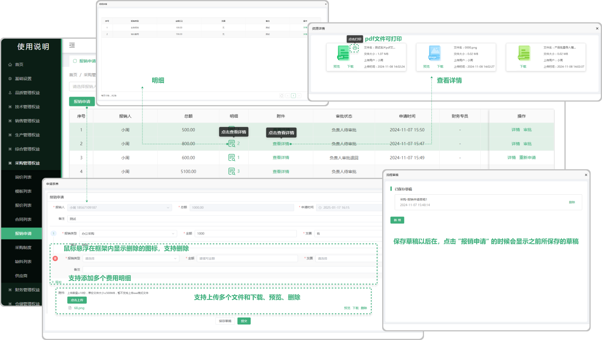
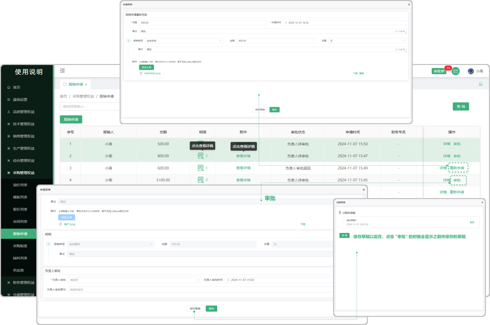

# 报销申请

> "报销申请列表”位于"采购管理板块，在报销申请列表中可以新增所报销的单子（可上传多个附件、添加多个费用明细），需要审批人进行审批（有审批这个权限的人员才能审批，可到基础设置中的， ”流程权限管理“ 中设置）如果审批被退回，需要重新发起申请，新增完报销单子以后页面可以查看明细、附件

#### 1. 新增报销申请
* 点击报销申请可新增报销单，（可上传多个附件（支持删除、下载、预览）、添加多个费用明细）

#### 2.保存草稿功能、

* 可存为草稿，草稿可在新增报销单，点击 ”报销申请“按钮 的时候显示之前所保存的草稿

#### 3.明细

* 在申请报销时所添加的明细（明细下方对应的图标数字是指当时添加了多少明细）

#### 3.附件
* 指在申请报销时所上传的文件（支持打印，下载）

#### 4. 审批

* 当新增完报销申请时，需要审批人去审批（有审批这个权限的人员才能审批，可到基础设置中的， ”流程权限管理“ 中设置）

#### 5.重新申请

* 指的是被审批人退回来，需要再次重新申请

