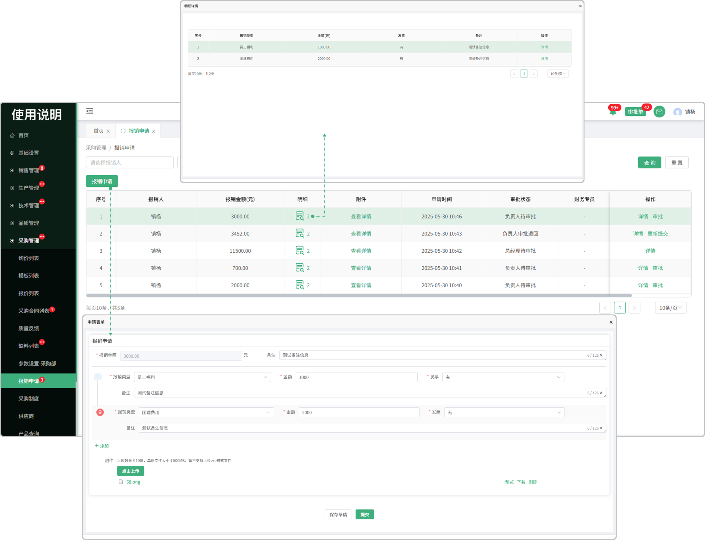
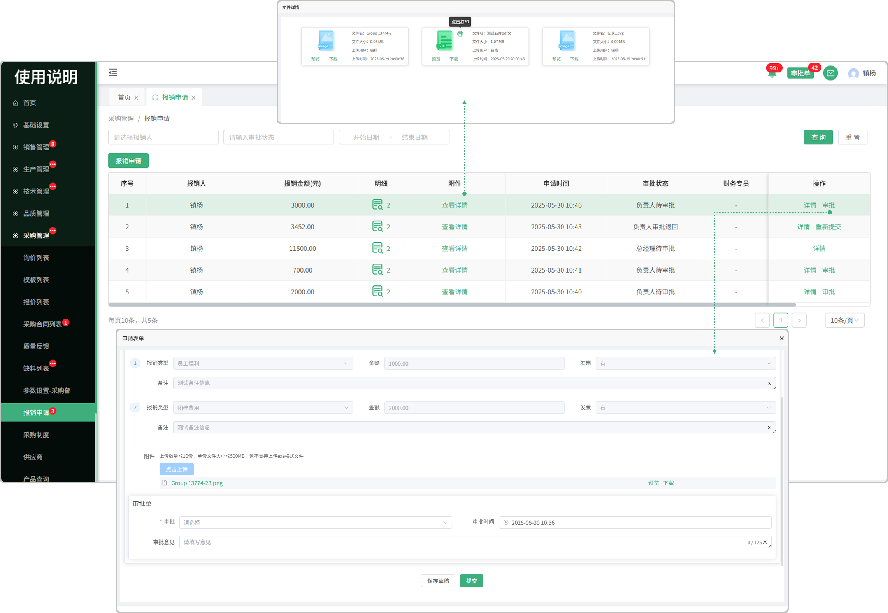
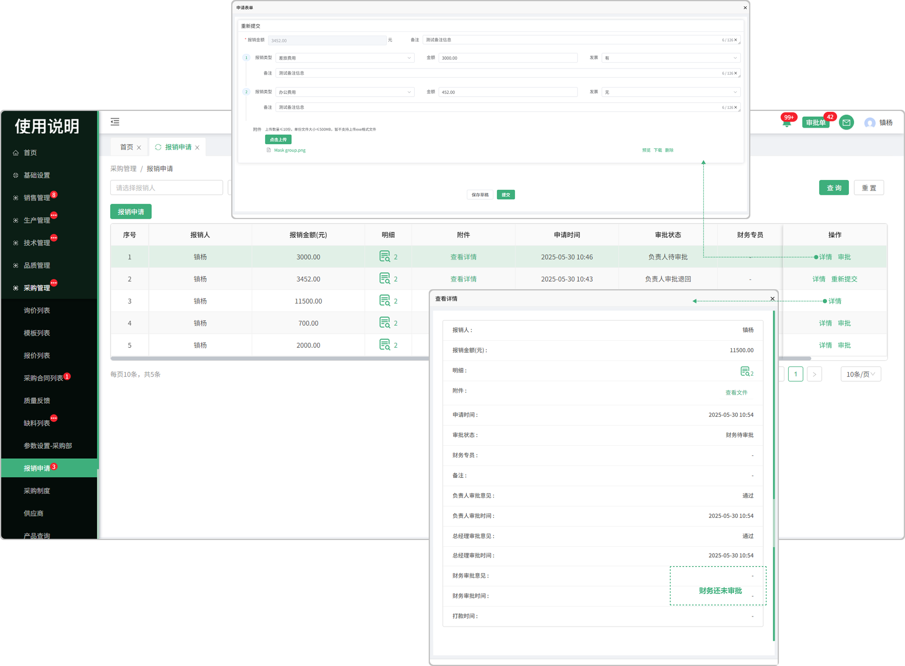

# 报销申请

> "报销申请列表”位于采购管理板块，在报销申请列表中可以新增所报销的表单（可上传多个附件、添加多个费用明细），需要审批人,总经理，财务进行审批，如果审批被退回，需要重新发起申请，新增完报销表单后页面可以查看明细、附件

#### 1. 新增报销申请
* 点击报销申请按钮可新增申请表单

   -点击添加报销类型，可一次性上传多个报销类型的申请，鼠标悬浮报销类型上面，支持删除报销类型

   -在报销申请中可以点击上传附件，可上传多个附件（支持预览、下载、删除）

#### 2.明细

* 点击明细可查看这条报销表单的报销类型

  -数字代表这个表单中有多少个报销类型

#### 3.保存草稿功能、

* 可存为草稿，再次点击报销申请的时候显示之前所保存的草稿

#### 4. 审批

* 分为负责人审批、总经理审批，财务审批

  -需要有这个审权限的人才能审批（可到基础设置-流程权限管理中设置审批权限），普通员工只显示详情

#### 5.附件

* 指在报销申请时所上传的文件（支持预览，下载，PDF打印）

#### 6.重新申请

* 如果负责人，总经理，财务等一方审批的时候被退回，则需要重新发起申请

  -在原来编辑的基础上重新发起

  -前提是需要有这个审权限的人才能重新发起（可到基础设置-流程权限管理中设置审批权限）

#### 7.详情

* 可查看报销申请的详细内容
* 可查看负责人，总经理，财务审批的意见和时间

