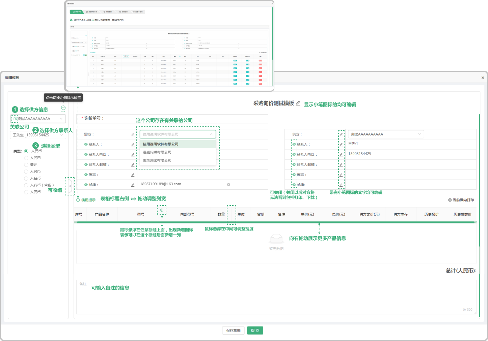
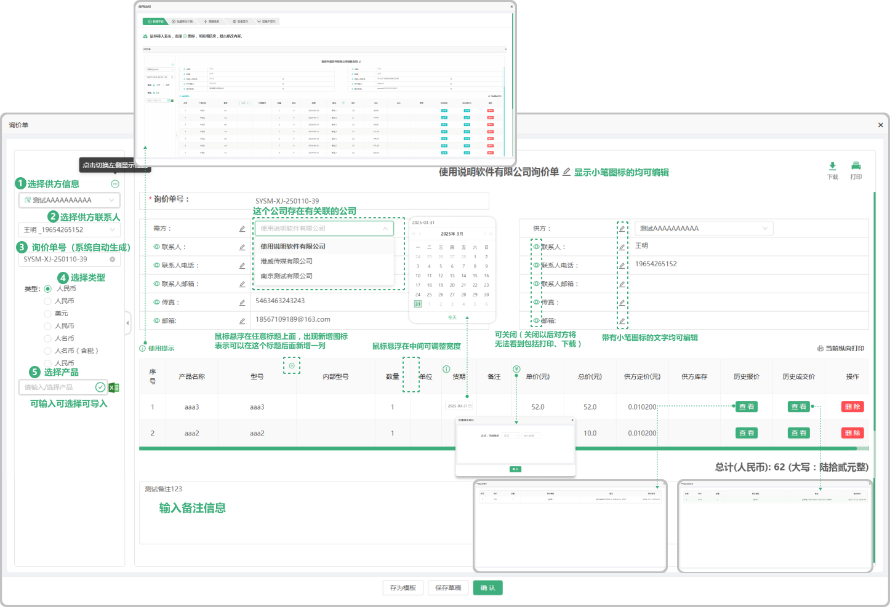
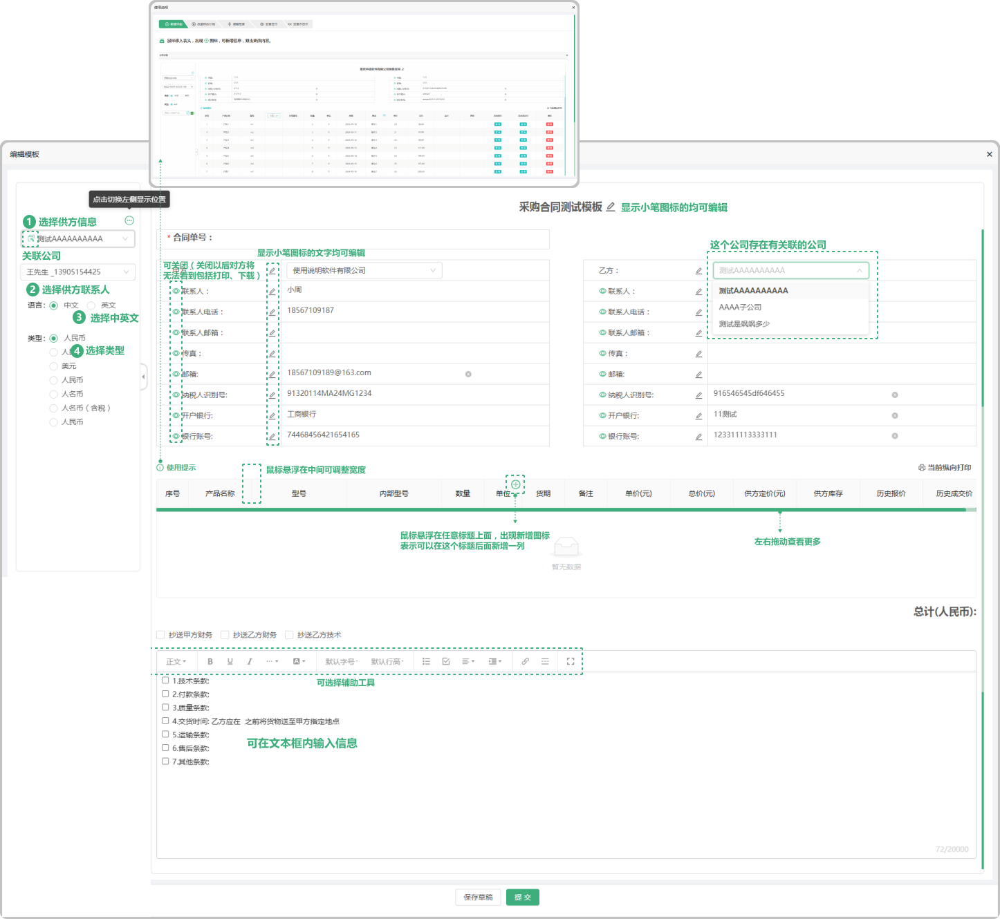

# 模板列表-采购

> "模板列表"采购管理板块，在"模板列表"中新增 "采购询价模板" "采购合同模板"

#### 1. 如图所示：
* 新增模板：点击新增模板,输入模板的名称,选择模板的类型(分为两种:采购询价和采购合同)，填写排序值(排序值是指输入的数字越大这个文件提交完成以后在表单的排列就越靠前面
* 模板状态：分为可用(在编辑完提交以后) ,草稿(编辑完模板没有提交而是保存草稿)
* 草稿状态用法：点击草稿后面的 "详情" 打开文件进行提交就转换为 "可用" 状态了

#### 2. 如图所示：采购询价单模板

> "采购询价模板"在"询价列表" 中新增询价单时可选用模板，可以选择供方信息、供方联系人、类型、支持修改需方、供方名称、鼠标悬浮在表字段可以添加新的"字段"(双击编辑字段名称),新加字段支持"删除" "添加" 表格标题右侧可拖动调整列宽,拖动下方滚动条可查看更多信息、可添加备注

* 供方信息：来源于采购管理,供应商列表中添加的客户信息
* 供方联系人：采购管理,来源于供应商列表中添加了的联系人(可添加多个联系人)
* 类型：来源于财务管理，汇率税率列表中添加的汇率税率信息

#### 3. 如图所示：模板列表页面中"新增询价"

> "新增询价"位于模板列表中添加的询价模板字段中,创建的模板可直接生成询价单转到采购管理,"询价列表中",可下载打印 

* 供方信息：来源于采购管理,供应商列表中添加的客户信息
* 供方联系人：采购管理,来源于供应商列表中添加了联系人(可添加多个联系人)
* 类型：来源于财务管理,汇率税率列表中添加的汇率税率信息
* 选择产品：产品来源于所添加供应商公司的产品列表中的产品（可以输入型号创建产品字段）
* 批量导入：可批量导入产品（先下载模板Excel进行编辑导入即可）
* 小眼睛图标：指的是页面中在甲乙方列表中的小眼睛图标，默认全展示，可关闭或者打开（如果关闭对方将无法看到这条信息，包括打印和下载都不展示）
* 历史报价：跟这个公司销售过这个产品，如果再次报价就会有之前的报价信息
* 历史成交价：跟这个公司销售过这个产品,成功了以后再次销售会有之前的历史成交价
* 总计：是所添加的产品单价的总计(支持更改单价添加公式(加 , 减 , 乘(乘的是百分比也就是0.01) 输入数值)
* 字段更改：在添加产品信息以后可以悬浮对应的产品信息如果出现"更改的图标"就代表可以更改这个产品内容的信息,或者出现时双击也可以更改
* 存为模板：如果点击存为模板在模板中展示所存的模板
* 确认：如果点击确认,在询价列表显示状态未报价.
* 保存草稿：点击保存草稿,在报价列表显示状态为 "草稿"

#### 4. 如图所示：采购合同单模板

> "采购合同单模板"在"合同列表" 中新增合同单时可选用模板，可以选择需方信息,需方联系人、语言、类型、支持修改需方、供方名称、鼠标悬浮在表字段可以添加新的"字段"(双击编辑字段名称),新加字段支持"删除","添加" 表格标题右侧可拖动调整列宽,拖动下方滚动条可查看更多信息,可添加条款内容,选择抄送对象,输入条款内容(支持 编辑,添加,删除)，在签章之前需选择交货时间确认交货地点（可在表格字段中或者表格字段下方添加日期）

* 供方信息：来源于采购管理,供应商列表中添加的客户信息
* 供方联系人：采购管理,来源于供应商列表中添加了联系人(可添加多个联系人)
* 类型：来源于财务管理,汇率税率列表中添加的汇率税率信息
* 语言：可选中文和英文

#### 5. 如图所示：模板列表页面中"新增合同单"

> "新增合同单"位于模板列表中添加的合同模板字段中,创建的模板可直接生成合同单转到采购管理,"合同列表中",可下载打印

* 供方信息：来源于采购管理,供应商列表中添加的客户信息
* 供方联系人：采购管理，来源于供应商列表中添加了联系人(可添加多个联系人)
* 类型：来源于财务管理,汇率税率列表中添加的汇率税率信息
* 语言：可选中文和英文
* 选择产品：产品来源于所添加供应商公司的产品列表中的产品（可以输入型号创建产品字段）
* 批量导入：可批量导入产品（先下载模板Excel进行编辑导入即可）
* 小眼睛图标：指的是页面中在甲乙方列表中的小眼睛图标，可关闭或者打开（如果关闭对方将无法看到这条信息，包括打印和下载都不展示）
* 历史报价：跟这个公司销售过这个产品，如果再次报价就会显示之前的报价信息
* 历史成交价：跟这个公司销售过这个产品,成功了后再次销售会有显示前的历史成交价
* 总计：是所添加的产品单价的总计(支持更改单价添加公式(加 , 减 , 乘(乘的是百分比也就是0.01) 输入数值)
* 字段更改：在添加产品信息后可以悬浮对应的产品信息如果出现"更改的图标"就代表可以更改这个产品内容的信息,或者出现时双击也可以更改
* 交货时间：位于合同的条款下面，双击在乙方“____”之前..
* 存为模板：如果点击存为模板在模板列表中展示所存的模板
* 签章：如果点击签章在选择合同章确认以后,在合同列表显示，（签章之前需填写交货时间）
* 保存：点击保存,在合同列表显示状态为 "未签章"，点击详情可进去签章

