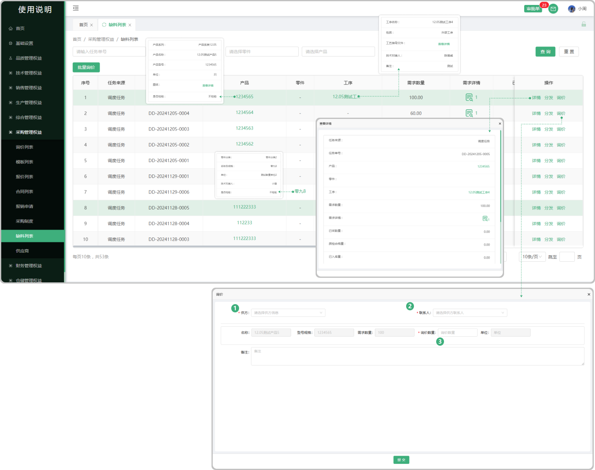
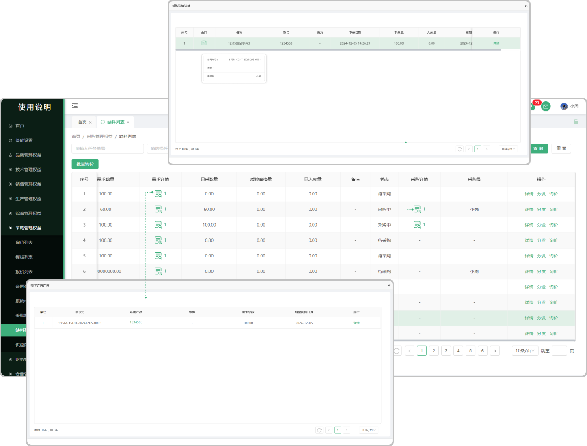

# 缺料列表

> "缺料列表“ 位于采购管理板块 ，缺料列表的数据主要来源于在调度排单时采购的材料（采购、外协），采购完成以后会带到缺料列表中，进行分发、询价
​
#### 1. 如图所示：
* 产品：采购的这个产品（点击产品下方对应的产品名称可以查看产品的详情）
* 零件：采购的这个零件（点击零件下方对应的零件名称可以查看零件的详情）
* 工序：这个产品/零件当时所添加的工序（点击产品/零件下方对应的工序名称可以查看工序的详情）
* 详情：点击详情按钮可查看这个产品/零件的详情信息
* 询价：指可以对这个产品/零件进行询价，点击询价打开弹窗填写询价的公司、联系人、询价数量以后确认生成询价单（支持修改产品数量），会带到采购板块的询价列表从而进行后面的报价，签章转为合同
* 批量询价：点击批量询价，勾选所需要询价的产品/零件（可一键勾选）勾选完成点击批量询价按钮弹出弹窗填写询价数量（存在相同产品/零件多次询价）
* 批量删除：点击批量删除，勾选所需要删除的产品/零件（可一键勾选）勾选完成点击批量删除按钮删除
​

* #### 2. 如图所示：
* 需求详情：点击需求详情下方对应的图标可查看这个产品/零件的需求信息（所属产品/零件、需求总数、到货日期）
* 采购详情：，默认不显示，只有点击询价进行报价、转合同以后才显示采购的详情（可点击查看）
* 分发：点击分发可以指定分发给某人（分发完成以后见面的采购员下面显示所分发的人员名称）
