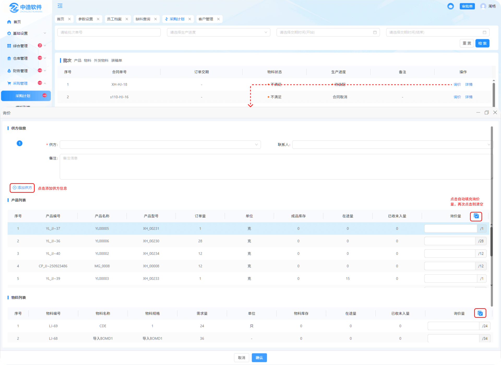
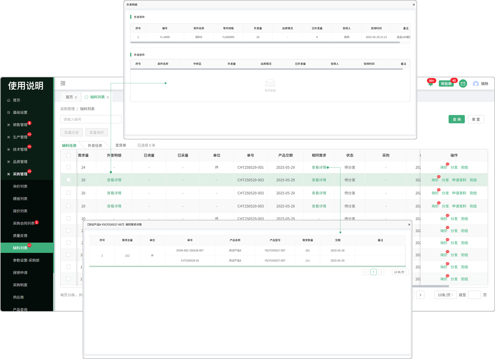
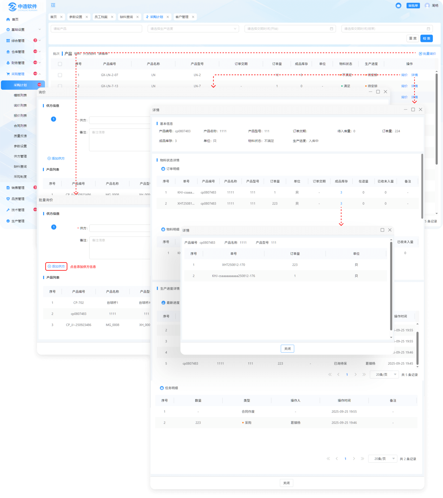
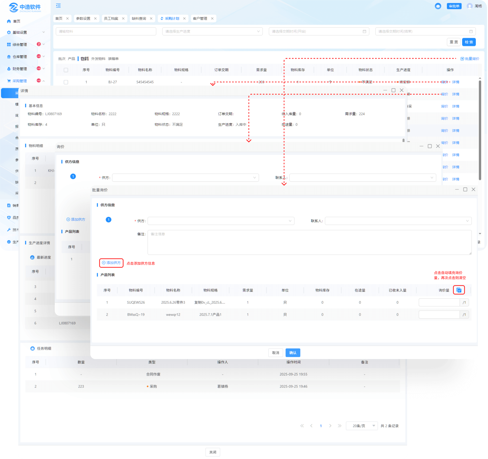
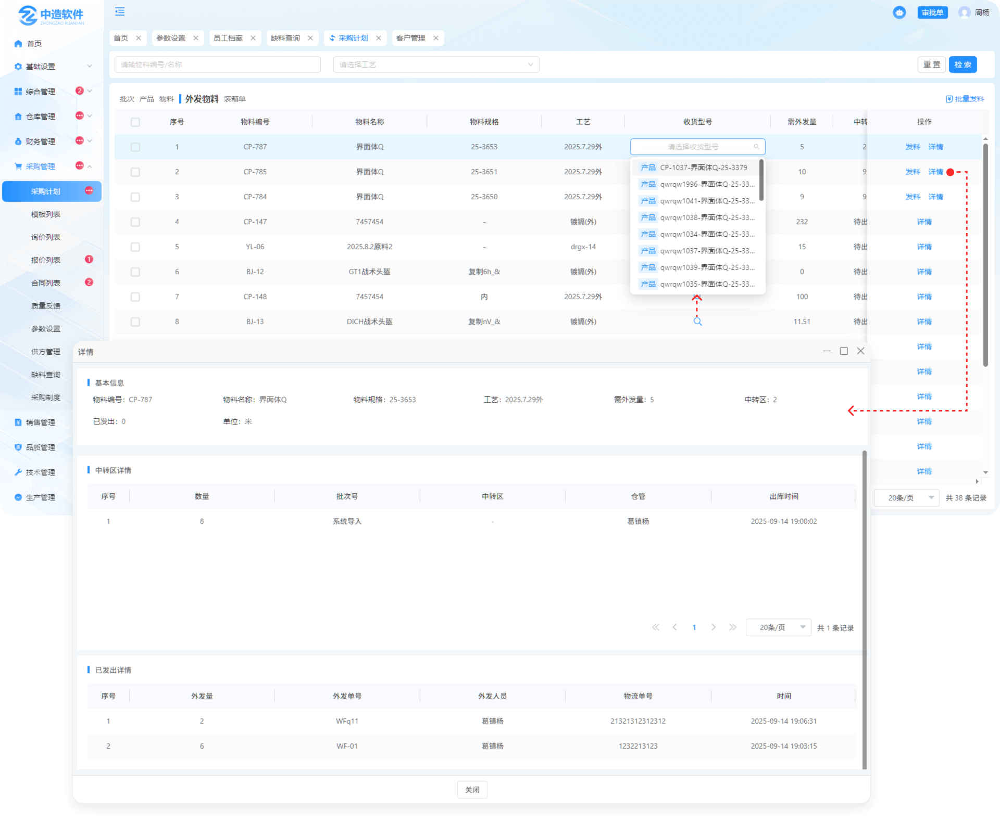
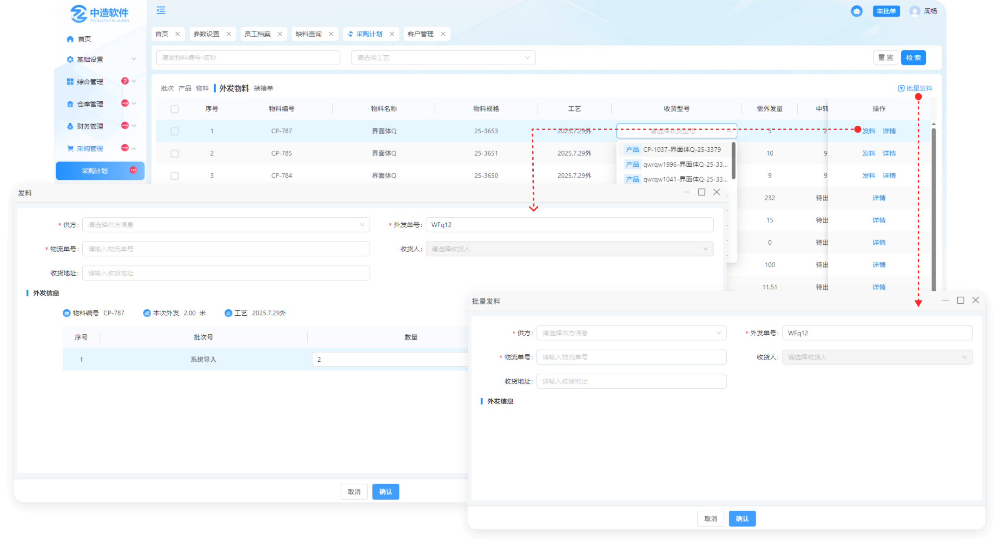
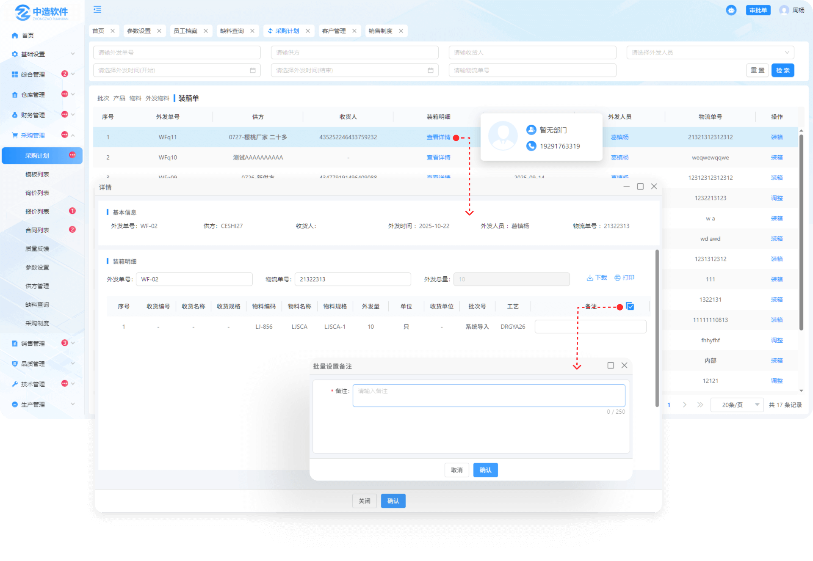
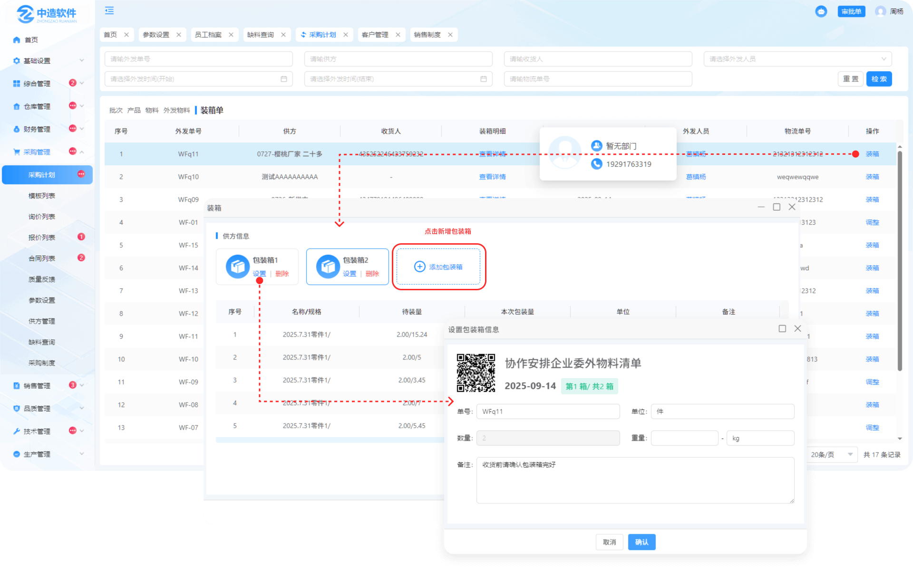

# 缺料列表

> "缺料列表“ 位于采购管理板块 ，所采购的任何成品/物料都会流转到缺料列表中,缺料列表分为5个页面，分别是：批次维度，产品维度，物料维度，外发物料维度，装箱单维度
​

## 批次

#### 1.询价

* 点击询价按钮新增询价

  -确认后将转到采购管理的询价列表中，状态是草稿，可点击详情进入转为合同

#### 2.退回

* 点击退回按钮可退回

  -待安排和已询待采的情况下支持退回

#### 3.详情

* 点击详情按钮可查看这个批次下的基本信息，物料状态详情，物料明细，生产进度，任务明细信息

   -订单详情：这个批次下的订单信息

   -物料明细：这个批次下所用的物料明细信息

   -生产进度详情：查看当前订单的生产进度

   -任务明细:可点击进度下方对应的数字查看详细任务进度信息

## 产品

#### 1.询价

* 点击询价按钮新增询价

  -确认后将转到采购管理的询价列表中，状态是草稿，可点击详情进入转为合同

#### 2.批量询价

* 勾选序号前的勾选框，点击批量询价按钮，可进行批量询价

  -确认后将转到采购管理的询价列表中，状态是草稿，可点击详情进入转为合同

#### 3.详情

* 点击详情按钮可查看这个批次下的基本信息，物料状态详情，物料明细，生产进度，任务明细信息

  -订单详情：这个批次下的订单信息

  -物料明细：这个批次下所用的物料明细信息

  -生产进度详情：查看当前订单的生产进度

  -任务明细:可点击进度下方对应的数字查看详细任务进度信息

## 物料

#### 1.询价

* 点击询价按钮新增询价

  -确认后将转到采购管理的询价列表中，状态是草稿，可点击详情进入转为合同

#### 2.批量询价

* 勾选序号前的勾选框，点击批量询价按钮，可进行批量询价

  -确认后将转到采购管理的询价列表中，状态是草稿，可点击详情进入转为合同

#### 3.详情

* 点击详情按钮可查看这个批次下的基本信息，物料状态详情，物料明细，生产进度，任务明细信息

  -订单详情：这个批次下的订单信息

  -物料明细：这个批次下所用的物料明细信息

  -生产进度详情：查看当前订单的生产进度

  -任务明细:可点击进度下方对应的数字查看详细任务进度信息

## 外发物料

#### 1.收货型号

* 点击图标或者已有的型号可进行选择或切换收货型号

#### 2.详情

* 点击详情按钮可查看外发物料的基本信息，中转区详情，已发出详情

   -在仓库的仓库列表中可设置中转区

   -可已发出详情中查看已发出的外发量，外发单号，外发人员，物流单号，时间

#### 3.发料

* 点击发料按钮输入供方信息，外发单号，物流单号，收货人，收货地址

* 在外发信息中可看到，外发的物料编号，本次外发，工艺等详细信息

   -在下方输入外发数量，点击确认即可

#### 4.批量发料

* 勾选序号前的勾选框，点击批量发料按钮

## 装箱单

#### 1.外发人员

* 点击外发人员名称可查看人员的基本信息

#### 2.装箱明细

* 点击查看详情按钮查看基本信息与装箱明细

  -支持下载/打印

  -支持批量备注

#### 3.装箱

* 点击设置按钮可设置包装箱信息

* 可添加包装箱

  -当本次包装量大于/等于待装量时，不可添加包装箱

  -当本次包装量小于待装量时，可添加包装箱

# 下面是有路线版本讲解

#### 1.批量询价

* 勾选所需要询价的产品/物料（可一键勾选）勾选完成点击批量询价按钮在弹窗中添加供方，填写询价数量，需求货期
* 可添加多个供方一起询价，点击提交数据会流转到采购管理-询价列表，显示草稿状态

  -可点击添加备注

* 相同型号规格的会合并处理，询价数量为合计值，需求货期会取最小值

#### 2.批量分发

* 勾选所需要分发的产品/物料（可一键勾选）勾选完成点击批量分发按钮在弹窗中选择分配采购人员，备注信息
* 分发明细：可查看单号，产品交期，产品名称，型号

#### 3.型号规格

* 分为产品和物料，用图标区分

#### 4.收货型号

* 当生产安排时，有工艺路线且工序是外部工序，走采购时会到缺料列表中，显示收货型号
* 收货型号：填写收货的型号，当收到货物时将对应填写的型号进入库存

#### 5.自定义表头
* 点击自定义表头图标可进行自定义表头设置

#### 6.外发明细

* 外发时产生的明细，点击可查看详细明细
* 外发明细分为：外发零件/外发部件，根据产品的工艺路线中工序所配的零件/部件展示详情
* 只有生产安排时，有工艺路线且工序是外部工序，走采购的才显示外发明细

#### 7.相同需求

* 如果页面中有相同的产品/型号/规格时，会在相同需求中显示出来

#### 8.询价
* 可对这个产品/物料进行询价，点击询价按钮在弹窗中填写供方信息，询价数量，需求货期

* 可添加多个供方一起询价，点击提交数据会流转到采购管理-询价列表，显示草稿状态

  -可点击添加备注

#### 9. 分发

* 点击分发按钮选择采购员，填写备注信息

#### 10.申请发料
* 可选择外发零件/外发部件
* 支持添加零件/部件

#### 11.完结

* 点击完结可结束这个任务

# 外发任务

> 申请发料后数据会流转到外发任务中，在外放任务中可发料，补发

#### 1.发料

* 点击发料按钮输入供方信息，物料单号，收货人，收货地址，选择收货型号，填写外发量，备注信息

#### 2.补料

* 发料完成以后还可以进行补料
* 输入供方信息，物料单号，收货人，收货地址，可选择收货型号，填写补发量，备注信息

# 发货单

> 在外发任务中发料完成后，生成发货单，可在发货单页面进行装箱

#### 1.外发人员

* 鼠标悬浮在外发人员名称上显示这个人员的基本信息（名称，部门，电话）

#### 2.装箱

* 点击设置图标可编辑包装箱信息
* 点击黄色包装箱图片可查看/编辑装箱量

#### 3.新增包装箱

* 点击新增图标可添加包装箱数量

