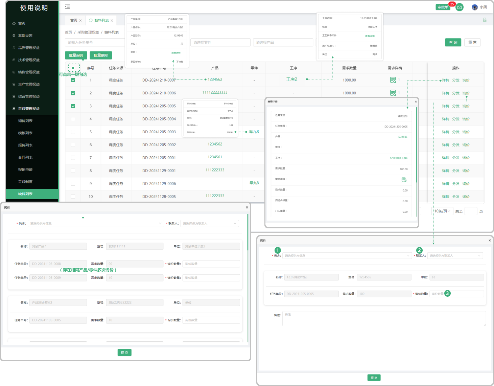
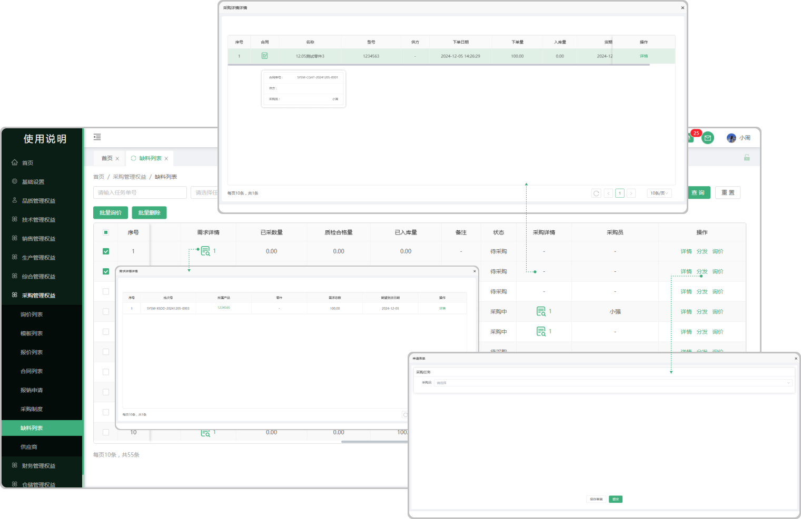

# 缺料列表

> "缺料列表“ 位于采购管理板块 ，所采购的任何零件物料等等都会流转到缺料列表中
​

#### 1.询价
* 可对这个产品/零件进行询价，点击询价打开弹窗填写询价的公司、联系人、询价数量以后确认生成询价单

  -生成的询价单会带到采购板块的询价列表从而进行后面的报价，签章转为合同

#### 2.批量询价

* 点击批量询价，勾选所需要询价的产品/零件（可一键勾选）勾选完成点击批量询价按钮弹出弹窗填写询价数量（存在相同产品/零件多次询价）

  -所选相同的产品/零件，会划分到一起（存在多次询价)

  -支持一键选择/取消

#### 3.批量删除

* 点击批量删除，勾选所需要删除的产品/零件（可一键勾选）勾选完成点击批量删除按钮删除

#### 4.产品/零件/工序
* 产品：采购的这个产品（点击产品下方对应的产品名称可以查看产品的详情）

* 零件：采购的这个零件（点击零件下方对应的零件名称可以查看零件的详情

* 工序：这个产品/零件当时所添加的工序（点击产品/零件下方对应的工序名称可以查看工序的详情）

#### 5. 分发

* 点击分发可以指定分发给某人（分发完成以后见面的采购员下面显示所分发的人员名称）

#### 6.需求详情

* 需求详情：点击需求详情下方对应的图标可查看这个产品/零件的需求信息（所属产品/零件、需求总数、到货日期）

#### 7.采购详情

* 采购详情：，默认不显示，只有点击询价进行报价、转合同以后才显示采购的详情（可点击查看）

#### 8.详情

* 详情：点击详情按钮可查看这个产品/零件的详情信息

