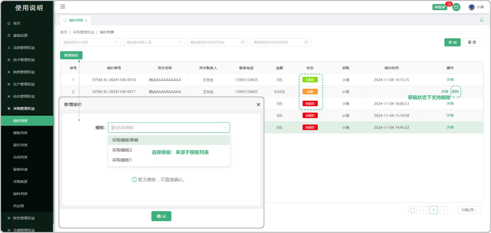

# 询价列表

> "询价列表”位于"销售管理板块，在"询价列表"中新增 "询价单" 

#### 1. 如图所示：
* 新增询价单：点击新增询价单选择模板（也可不选择直接进入询价单签署）
* 询价单状态 : 分为”已报价“   “未报价”   "草稿”（可以删除）
* 未报价 : 新增询价单确认以后界面显示未成交
* 已报价：新增的询价单会带入到需方哪里，在需方销售部的 “询价单列表进行分发处理以后，显示 “已报价”状态
* 草稿：新增报检单点击保存草稿（支持删除）

#### 2. 如图所示："新增询价"

> "新增询价"位于模板列表中添加的询价模板字段中,创建的模板可直接生成询价单转到采购管理,"询价列表中",可下载打印

* 供方信息 : 来源于采购管理,供应商列表中添加的客户信息
* 供方联系人 : 采购管理,来源于供应商列表中添加了的联系人(可添加多个联系人)
* 类型 : 来源于财务管理,汇率税率列表中添加的汇率税率信息
* 选择产品 : 产品来源于所添加供应商公司的产品列表中的产品（可以输入型号创建产品字段）
* 批量导入：可批量导入产品（先下载模板Excel进行编辑导入即可）
* 小眼睛图标：指的是页面中在甲乙方列表中的小眼睛图标，默认全展示，可关闭或者打开（如果关闭对方将无法看到这条信息，包括打印和下载都不展示）
* 历史报价 : 跟这个公司销售过这个产品，如果再次报价就会有之前的报价信息
* 历史成交价 : 跟这个公司销售过这个产品,成功了以后再次销售会有之前的历史成交价
* 总计 : 是所添加的产品单价的总计(支持更改单价添加公式(加 , 减 , 乘(乘的是百分比也就是0.01) 输入数值)
* 字段更改 : 在添加产品信息以后可以悬浮对应的产品信息如果出现"更改的图标"就代表可以更改这个产品内容的信息,或者出现时双击也可以更改
* 存为模板 : 如果点击存为模板在模板中展示所存的模板
* 确认:如果点击确认,在询价列表显示状态"未报价"
* 保存草稿 : 点击保存草稿,在报价列表显示状态为 "草稿"

