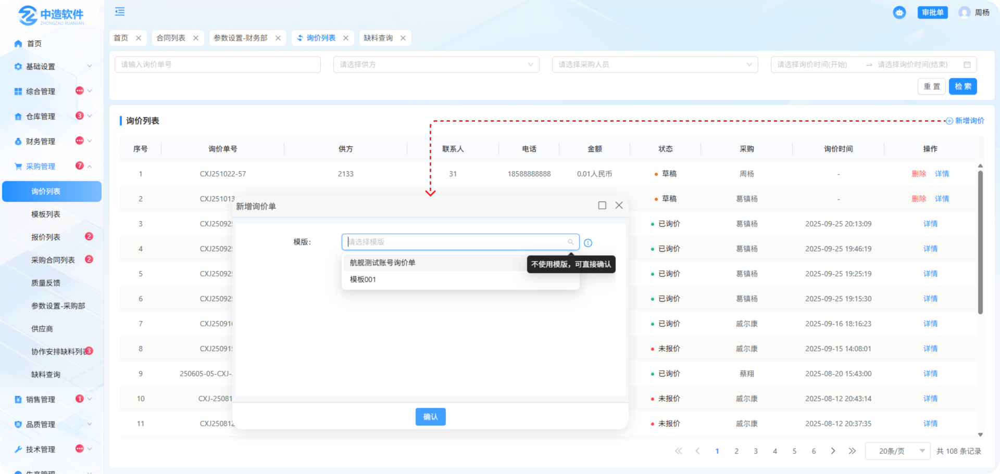
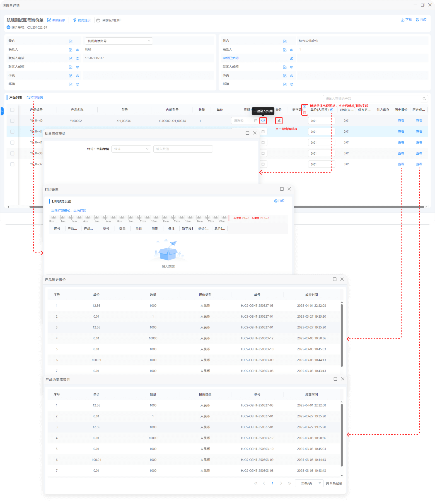

# 询价列表

> "询价列表”位于"采购管理板块，在"询价列表"中可向供方新增 "询价单" 

#### 1.新增询价
* 新增询价单包括

   -直接新建询价单

   -选择之前模板列表中所保存的询价单模板

  -缺料列表发起的询价

#### 2.询价单状态
* 询价单状态分为，已询价， 未报价、草稿

  -未报价 : 新增的询价单确认后界面显示未报价

  -已报价：新增的询价单会发送到供方哪里，在供方销售部的 “询价单列表进行处理以后，显示 “已报价”状态

  -草稿：新增的询价单点击保存草稿，显示草稿状态

#### 3.删除功能
* 草稿状态下的询价单支持删除

#### 4.询价单详情
* 供方信息：来源于采购管理,供应商列表中添加的客户信息

  -显示关联图标的代表这个公司有关联的子公司

* 关联公司：供方/需方可通过下拉框选择关联公司，同时会根据选择的关联公司，进行信息的更换

  -使用关联公司时，签章时所用的印章为关联公司印章。（关联公司印章也需要设置后对人员进行授权）

* 供方联系人 : 来源于供应商列表中添加的联系人(可添加多个联系人)
* 类型 : 来源于财务管理,汇率税率列表中添加的汇率税率信息
* 选择产品 : 产品来源于所添加供应商公司产品列表中的产品（可输入产品点击"对号"图标创建产品字段）
* 批量导入：可批量导入产品（先下载模板Excel进行编辑导入即可）
* 小眼睛图标：指的是页面中需方/供方列表中的小眼睛图标，默认全展示，可选择关闭或者打开（如果关闭对方将无法看到这条信息，包括打印和下载都不展示）
* 小笔图标：文字傍边带有小笔图标的方可编辑
* 下载图标：点击下载图标可下载当前页面内容
* 打印图标：点击可打印当前页面的信息
* 使用提示：点击使用提示可弹出弹窗，在弹窗中显示动图，可切换查看对应功能的使用（新增字段，批量修改价格，调整宽度，签章显示，签章不显示）
* 货期：点击选择货期时间
* 内部型号：点击选择内部型号（选择自己公司对应的产品，物料）
* 历史报价 : 跟同个公司询价过同个产品时，如果再次询价就会显示之前的产品历史报价信息
* 历史成交价 : 跟同个公司成交过这个产品，成功以后再次询价时会显示之前的产品历史成交价
* 单价/总计小数点位数显示：根据汇率税率列表中设置的小数位数显示小数位数

  -（例如：设置的小数位数是2位，产品列表中单价，总价显示的金额位数是两位）

* 总计 : 是所添加的产品单价的总计(支持更改单价添加公式(加 , 减 , 乘(乘的是百分比，1就是0.01) 输入数值)
* 字段更改 : 在添加产品信息以后可以悬浮对应的产品信息如果出现"更改的小笔图标"就代表可以更改这个产品的信息内容,或者双击也可以更改
* 产品查询：支持查询已添加的产品信息
* 批量删除：勾选序号前的勾选框方可批量删除已添加的产品，或点击删除图标单独删除
* 备注：可输入询价信息的备注
* 存为模板 : 如果点击存为模板在模板列表中显示所存的模板
* 确认:如果点击确认,询价单将发送给供方，询价列表显示状态"未报价"
* 保存草稿 : 点击保存草稿,在询价列表显示状态为 "草稿"

