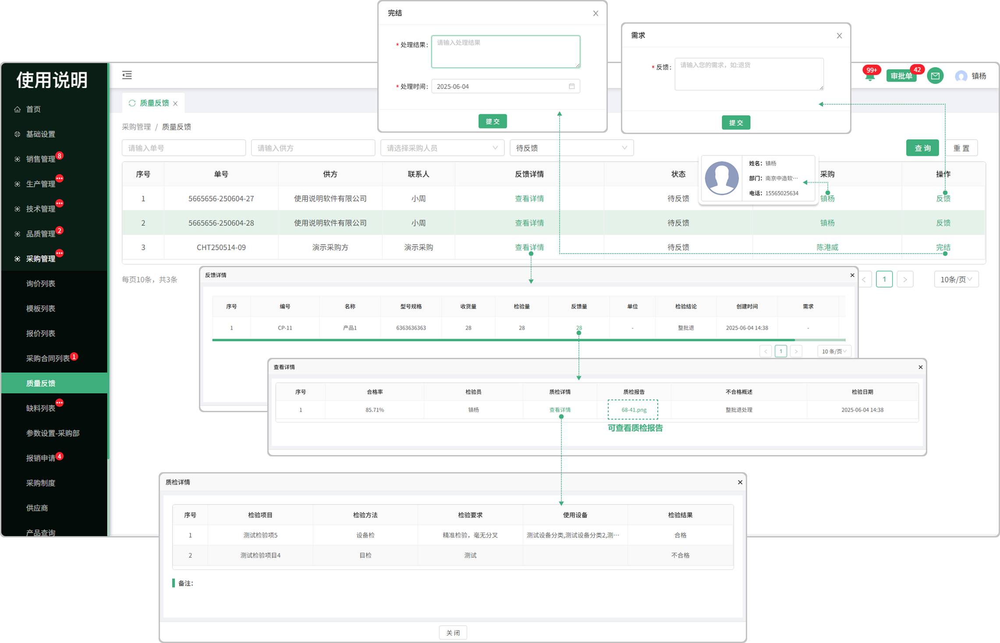

# 质量反馈

> "质量反馈列表”位于"采购管理板块，采购方在收到货物后送去入厂检检验,检验时不合格的产品选择了，不合格退，整批退，需审批（不合格退，整批退）时，质量反馈列表中将记录不合格的信息
> 
> 反馈：如果对方用了咱们的系统，则显示反馈
> 
> 完结：如果对方未使用咱们的系统，则显示完结

#### 1.反馈

* 点击反馈按钮输入反馈需求
* 对方将在销售管理的售后服务列表中看到您的反馈信息，并处理

#### 2.完结

* 点击完结按钮输入处理结果，处理时间，可完结这个不合格产品的信息
* 如果对方用了咱们的系统，则显示反馈，如果对方未使用咱们的系统，则显示完结

#### 3.采购员

* 鼠标悬浮在采购员名称上面显示采购员的基础信息（姓名，电话，部门）

#### 4.反馈详情

* 点击查看详情，可查看这个不合格品的，编号，名称，型号规格，收货量，检验量，反馈量，单位，检验结论，创建时间，需求，处理结果（需对方处理完可看到处理结果）
* 点击反馈量对应的数字可查看合格率，检验员，质检详情，质检报告，不合格概述，检验日期
* 质检详情：可查看质检的检验项，检验方法，检验要求，使用设备，检验结果，备注信息
* 质检报告：检验时所上传的报告，点击可查看

