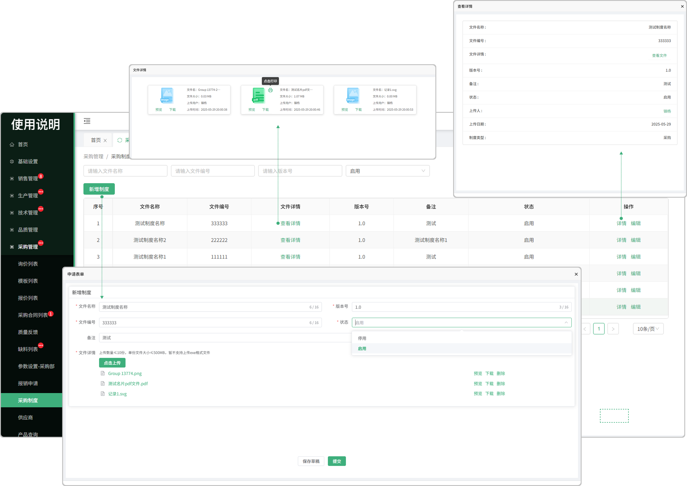

# 采购制度

> "采购制度列表"位于采购管理板块，在采购制度列表中可维护相对应的制度，支持编辑 

#### 1. 新增制度
* 输人文件名称，版本号，文件编号，备注信息，选择状态（启用/停用）
* 可上传多个文件，上传的文件支持预览，下载，删除
#### 2.保存草稿功能、

* 可存为草稿，再次打开新增时显示之前所存的草稿

#### 3.详情

* 点击详情可查看制度的基本信息

#### 4.文件详情

* 新增制度时上传的文件，点击可查看全部（支持下载、打印）

#### 5.编辑功能

* 可修改之前所新增的制度

