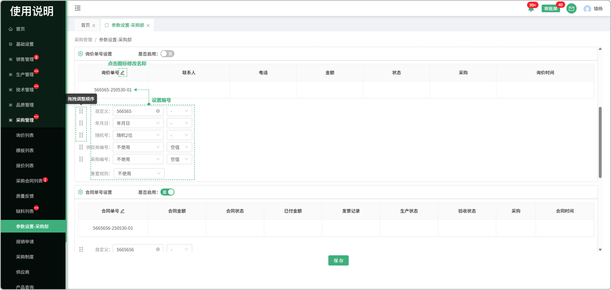
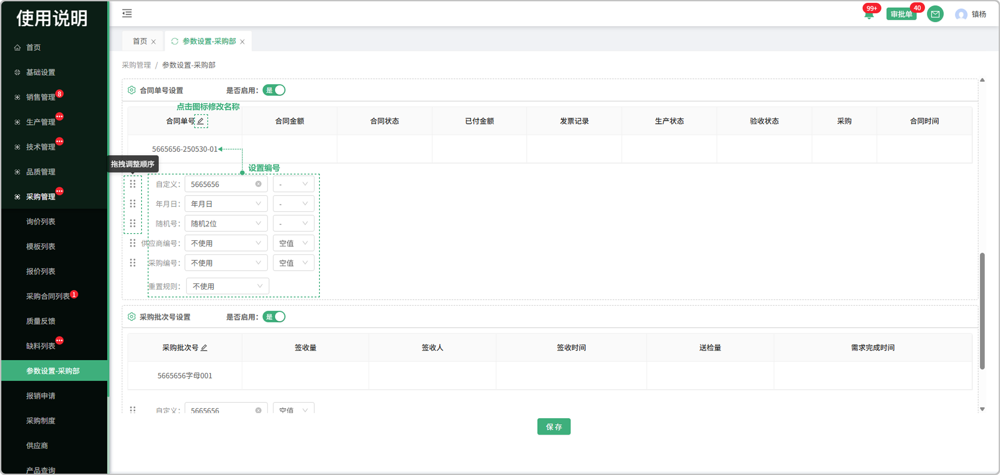
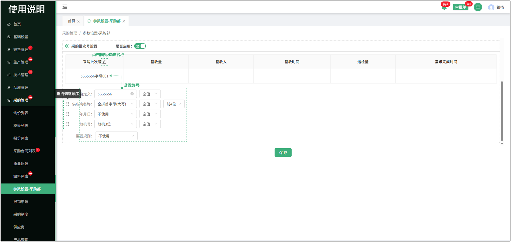

# 采购参数设置

> "采购参数设置"位于采购管理板块，可在参数设置中维护供方编号，询价单号，合同单号，采购批次号

#### 1.供方编号

* 是否启用：是代表使用，否代表不使用

* 编号名称：点击修改图标可修改供方编号名称

* 预览：所设置的供方编号可在表头中预览

* 供方编号设置：分为自定义，年月日，随机号，供应商名称，城市编号，采购编号，同时可选择符号带入，拖拽前方图标也可调整顺序

* 重置规则：分为日，月，年，不使用，列：选择了日，就代表一日后重置，年就是一年，不使用就是永久

#### 2.询价单号

* 是否启用：是代表使用，否代表不使用

* 编号名称：点击修改图标可修改询价单号名称

* 预览：所设置的询价单号可在表头中预览

* 询价单号设置：分为自定义，年月日，随机号，供应商编号，采购编号，同时可选择符号带入，拖拽前方图标也可调整顺序

* 重置规则：分为日，月，年，不使用，列：选择了日，就代表一日后重置，年就是一年，不使用就是永久

#### 3.合同单号设置

* 是否启用：是代表使用，否代表不使用

* 编号名称：点击修改图标可修改合同单号名称

* 预览：所设置的合同单号可在表头中预览

* 合同单号设置：分为自定义，年月日，随机号，供应商编号，采购编号，同时可选择符号带入，拖拽前方图标也可调整顺序

* 重置规则：分为日，月，年，不使用，列：选择了日，就代表一日后重置，年就是一年，不使用就是永久

#### 4.采购批次号设置

* 是否启用：是代表使用，否代表不使用

* 编号名称：点击修改图标可修改采购批次号名称

* 预览：所设置的采购批次号可在表头中预览

* 采购批次号设置：分为自定义，年月日，随机号，供应商名称，同时可选择符号带入，拖拽前方图标也可调整顺序

* 重置规则：分为日，月，年，不使用，列：选择了日，就代表一日后重置，年就是一年，不使用就是永久

