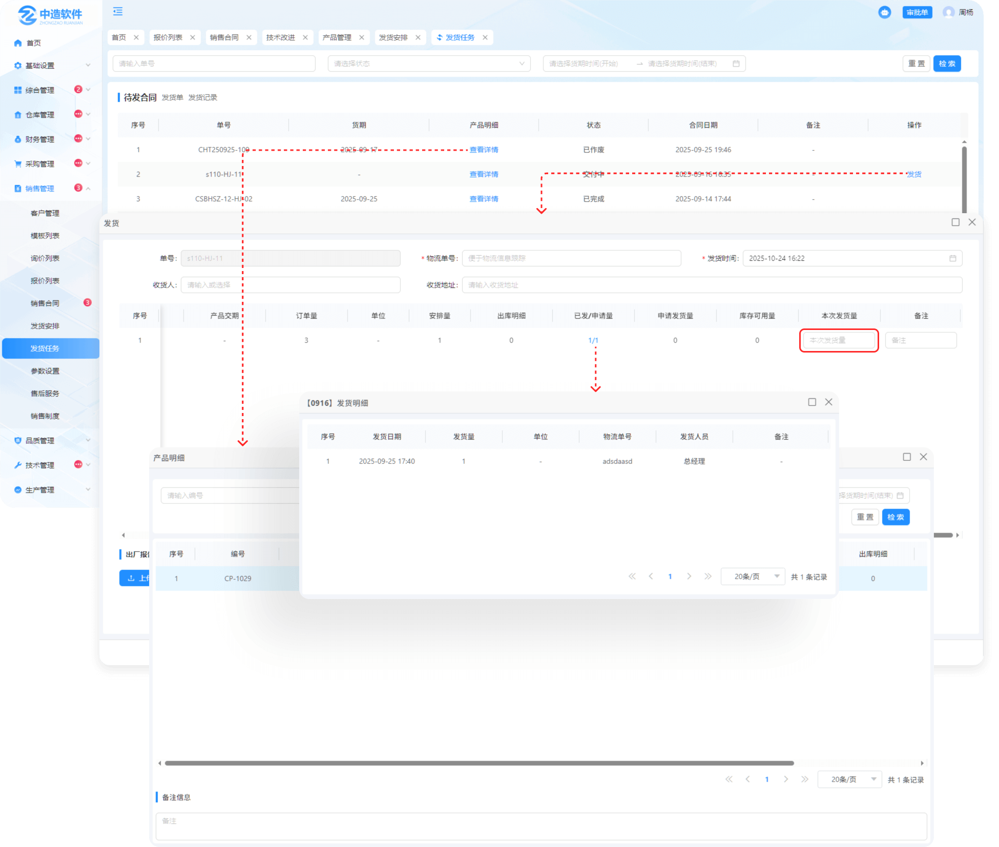
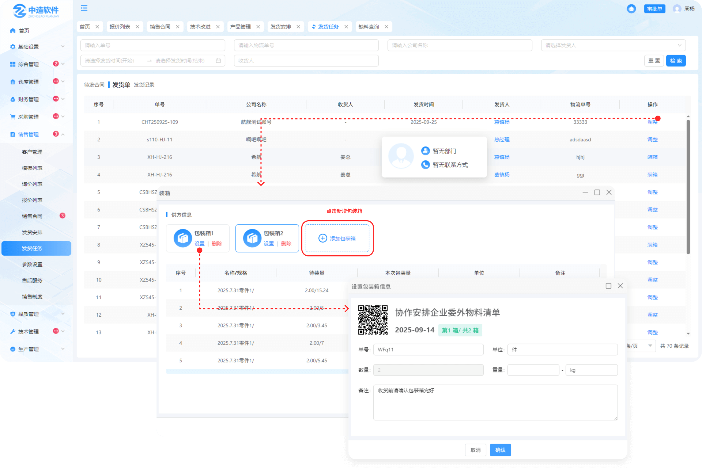
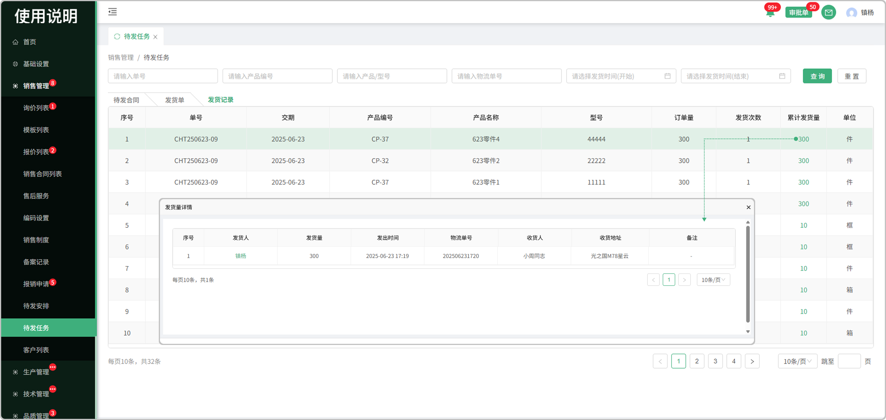

# 待发任务-待发合同

> “待发任务”位于“销售管理板块”包含待发合同，发货单，发货记录，来源：由待发安排中分发下来的任务

#### 1.待发合同

* 由待发安排中主管分发下来的任务

#### 2.发货

* 点击发货按钮进行发货，可选择本次发货量，填写收货人、收货地址、物流单号；

* 发货成功后，出库列表中会同步生成“成品出库”类型出库任务，出库完成后可进行后续操作

#### 3.产品明细

* 点击产品明细查看合同维度包含产品数据信息以及发货进度

# 待发任务-发货单

#### 1.发货单

* 在发货任务中发货完成以后，生成发货单，可在发货单页面进行装箱

#### 2.装箱

* 出库列表中，产品出库后，可进行装箱
* 点击设置图标可编辑包装箱信息
* 点击黄色包装箱图片可查看/编辑装箱量

#### 3.新增包装箱

* 点击新增图标可添加包装箱数量

# 发货记录

* 在发货任务中所产生的发货记录

* 支持单号，产品编号，产品/型号，物流单号，发货时间开始/结束

#### 1.累计发货量

* 点击可查看累计发货的数量

