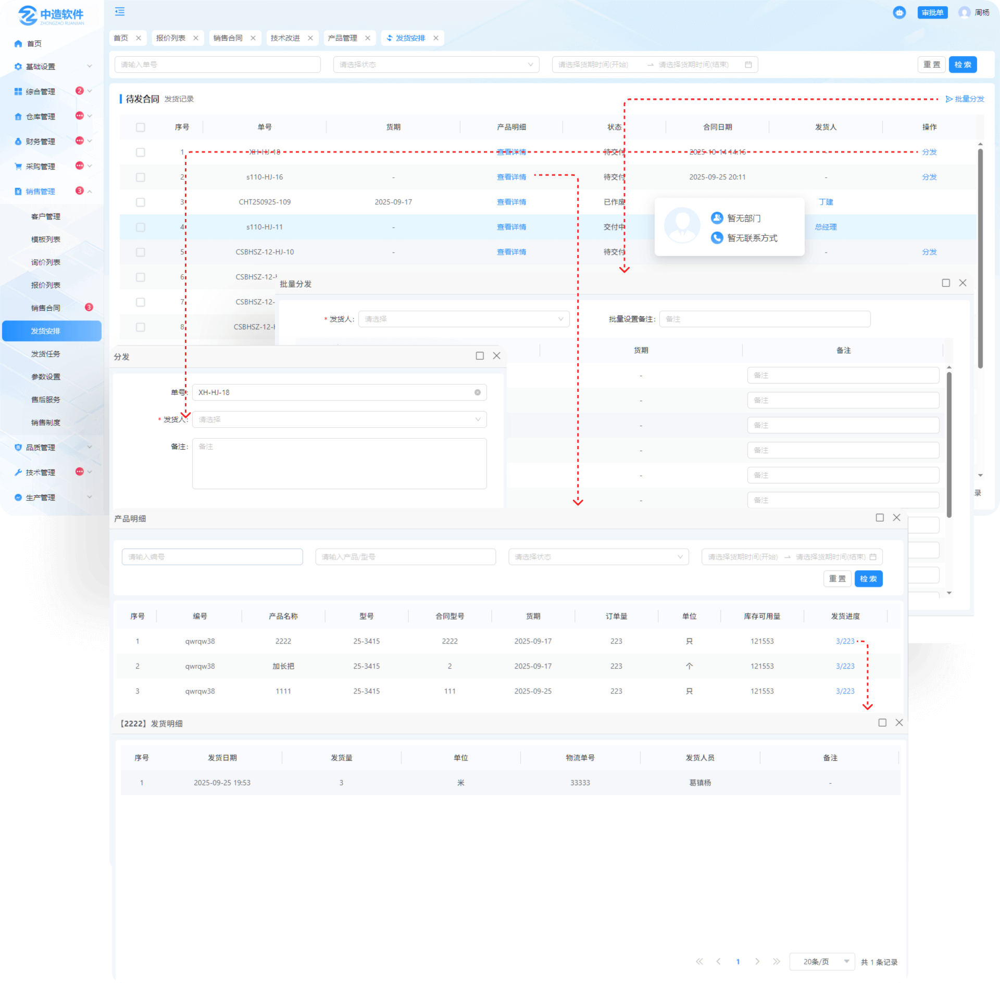
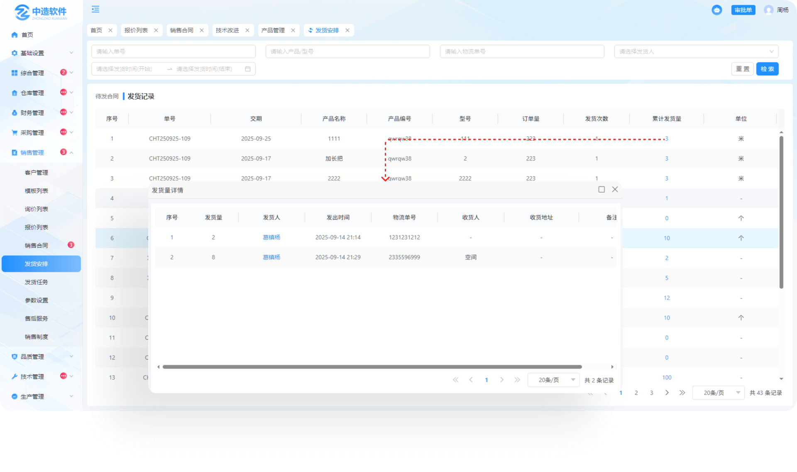

# 发货安排-待发明细
> “发货安排”位于“销售管理板块”包含待发合同、发货记录

#### 1.待发合同来源

* 销售合同签章完成点击开始生产，系统会触发待发任务，在待发任务中产生待发合同安排

#### 2.分配

* 在待发合同列表中，可以分配员工完成待发任务

* 分配完成的任务会在待发任务列表中显示

#### 3.批量分发

* 勾选序号前的勾选框，触发批量分发按钮，点击批量分发按钮可将所勾选的单子分配给员工

#### 4.产品明细

* 点击产品明细查看产品信息，包括产品名称、产品型号、产品编号、合同型号、货期、订单量、发货进度等字段信息
  -点击发货进度可查看发货明细。

#### 5.分发

* 点击分发按键选择当前工单发货人

# 待发安排-发货记录

#### 1.发货记录来源

* 待发任务-待发合同中点击发货请求后，发货记录界面中生成数据，显示合同信息，包括单号、交期、产品编号、产品名称、型号、订单量等数据信息

#### 2.累计发货量

* 点击累计发货量查看累计发货明细，包括发货量、发货人、发出时间、物流单号、收货人等信息

