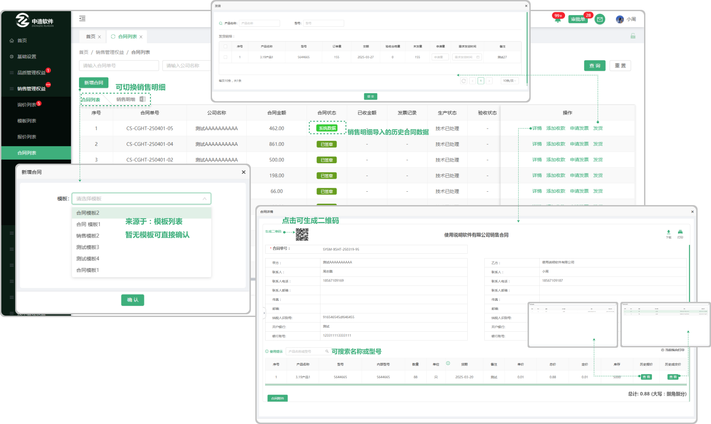
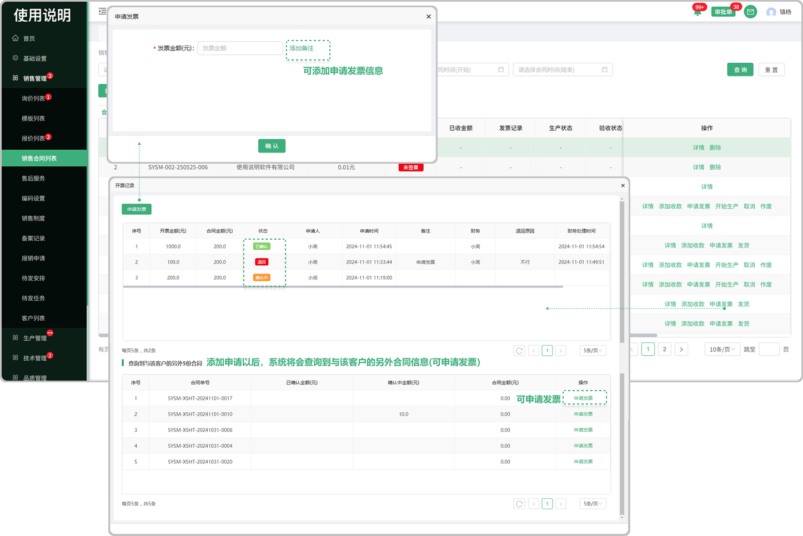
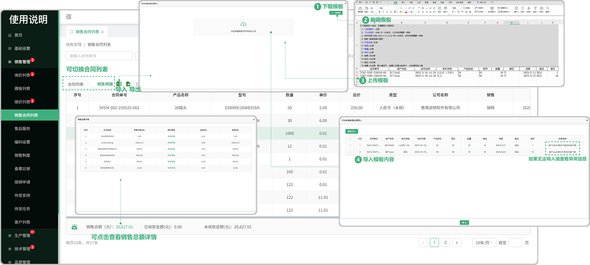

# 合同列表

> "合同列表“位于"销售管理板块，维护合同信息

#### 1. 新增合同：
* 生成合同的方式包括：

  -直接新建销售合同,  合同信息由销售人员编辑

  -将报价单转为销售合同,  合同信息由销售人员编辑

  -客户下单并签章后，接收到的合同，合同信息销售人员无法编辑，只能退回或签章

#### 2. 保存功能
* 编辑合同信息的时候，可以将合同暂存下来， 状态是未签章（支持删除）

#### 3. 存为模板功能
* 把 合同信息中，除了产品明细之外的内容，存成模板，供后续使用

#### 4. 合同附件功能
* 在签章前，可以上传一些允许被客户浏览的文件。

#### 5. 签章功能
* 可编辑的合同，合同信息拟定完毕后，可以同步发送给客户查看， 状态是已签章， 客户查看合同的方式包括：

    -使用系统的客户 ，可以登录自身系统，浏览合同，退回合同，签章

   -不使用系统的客户，可以登录航舰系统，浏览合同，退回合同，签章

* 接收到的，来自客户拟定好的合同，核对合同信息无误后，可以签章

#### 6. 取消功能
*  可编辑的合同，如果在合同签章后，发现合同信息有误，可以点击取消，重新编辑合同信息，类似于撤回的动作

 
* 接收到的，来自客户拟定好的合同，签章后无法取消

#### 7. 退回功能
* 接收到的，来自客户拟定好的合同，如果合同信息有误，可以直接退回让客户重新修改

#### 8.  开始生产功能：
* 签章后，销售人员可以点击开始生产，将生成销售订单，技术人员可以查看销售订单

* 点击开始生产后，销售合同无法取消，如果需要取消，需要联系技术人员退回

#### 9.  申请发票功能：签章后，向客户收款时，如果需要开发票，使用申请发票功能，后续由财务进行审批
* 一次性填写本次针对该客户的多个开票申请，这样财务可以一起处理。

* 开票申请被财务人员退回后，可以重新编辑
  

#### 10.  添加收款功能：签章后，向客户收款时，使用添加收款功能，后续由财务进行核对，审批
* 一次性填写本次针对该客户的多个收款申请，这样财务可以一起处理。

* 收款申请被财务人员退回后，可以重新编辑
  

#### 11. 其余功能

* 需方信息：来源于销售管理,客户列表中添加的客户信息
* 需方联系人：销售管理,来源于客户列表中添加了联系人(可添加多个联系人)
* 语言：可选中文和英文
* 类型：来源于财务管理,汇率税率列表中添加的汇率税率信息
* 等级：来源于财务管理,产品等级列表中添加的产品等级信息
* 选择产品：产品来源于 "产品列表" 中所添加的产品（可以输入型号创建产品字段）
* 小眼睛图标：指的是页面中在甲乙方列表中的小眼睛图标，默认全展示，可关闭或者打开（如果关闭对方将无法看到这条信息，包括打印和下载都不展示）
* 批量导入：可批量导入产品（先下载模板Excel进行编辑导入即可）
* 使用提示：点击使用提示可弹出弹窗，在弹窗中显示动图，可切换查看对应功能的使用（新增字段、批量修改价格、调整宽度、签章显示、签章不显示）
* 历史报价：跟这个公司销售过这个产品，如果再次报价就会显示之前的报价信息
* 历史成交价：跟这个公司销售过这个产品,成功了以后再次销售会显示之前的历史成交价
* 总计：是所添加的产品单价的总计(支持更改单价添加公式(加 , 减 , 乘(乘的是百分比也就是0.01) 输入数值)
* 字段更改：在添加产品信息以后可以悬浮对应的产品信息，如果出现"更改的图标"就代表可以更改这个产品内容的信息,或者出现时双击也可以更改
* 交货时间：位于合同的条款下面，双击在乙方“____”之前..

# 销售明细
> 可在 “销售合同”列表切换 “销售明细”

#### 1.销售明细
* 销售总额：显示销售的总金额，点击可查看销售总额的详情
* 已收款金额：显示已经收款的金额
* 