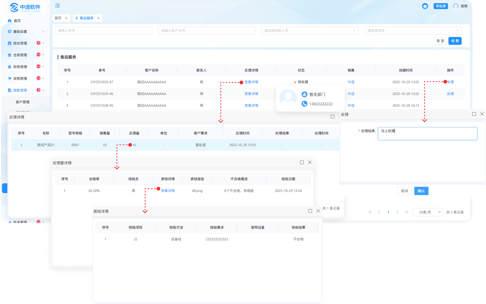

# 售后服务

> "售后服务列表”位于"销售管理板块，采购方在采购管理的质量反馈列表中反馈的信息，将带到我方销售管理的售后服务列表，由我方人员进行处理

#### 1.处理

* 点击处理按钮输入处理结果
* 对方将在采购管理的质量反馈列表中看到您的处理结果

#### 3.销售员

* 点击人员名称显示销售员的基础信息（电话，部门）

#### 4.反馈详情

* 点击查看详情，可查看这个不合格品的名称，型号规格，销售量，反馈量，单位，客户需求，反馈时间，处理结果，处理时间等信息
* 点击反馈量对应的数字可查看合格率，检验员，质检详情，质检报告，不合格概述，检验日期等信息
* 质检详情：可查看质检的检验项，检验方法，检验要求，使用设备，检验结果等信息
* 质检报告：检验时所上传的报告，点击可查看

