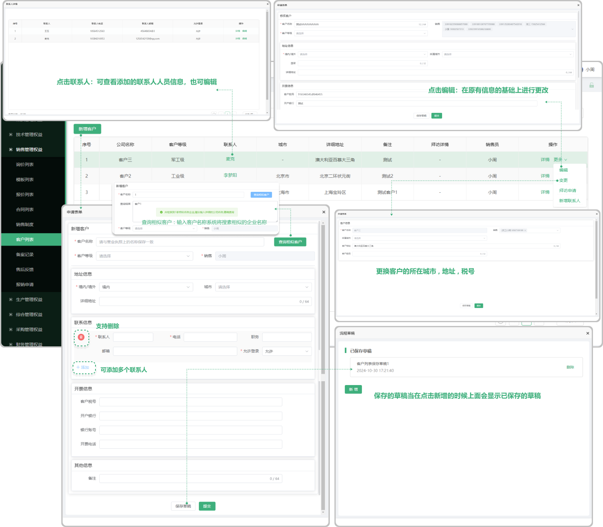
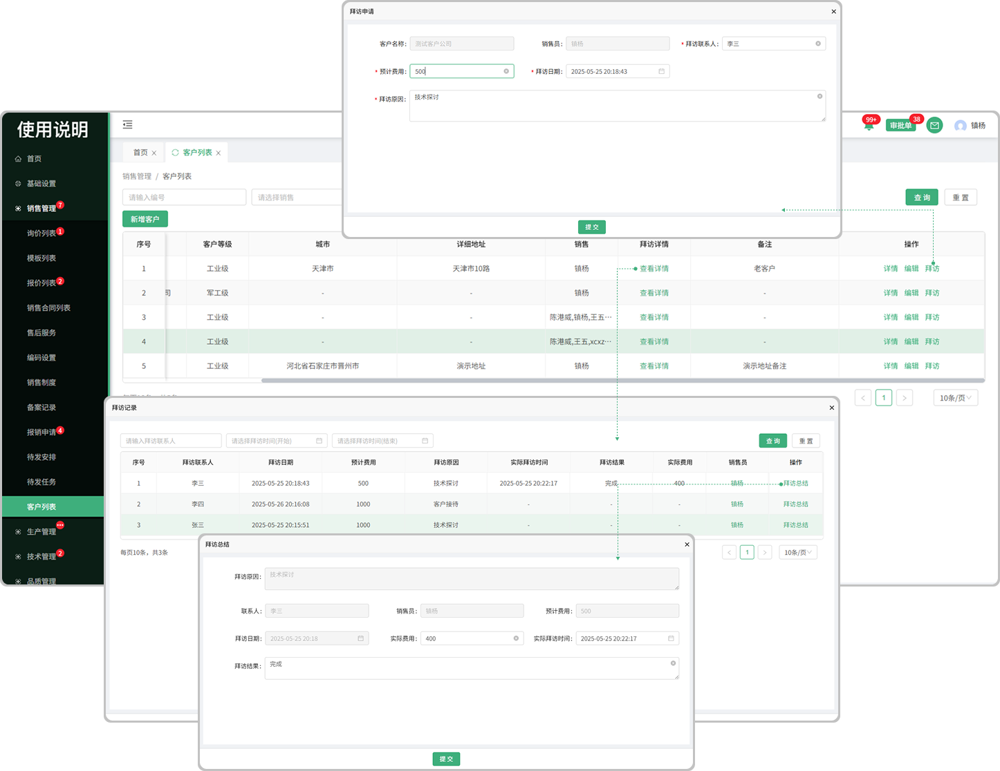

# 客户列表

> "客户列表"位于销售管理板块，在"客户列表"中维护"客户信息" 后,发起报价，合同时，才能选择到这些客户。

> 功能包括：新增客户,支持 ( 编辑 , 变更, 拜访申请 ,新增联系人 )

#### 1. 客户信息：
* 新增客户:点击 "新增客户"   

   1.首先选择客户名称以及等级以后 
 
   2.填写境内/境外(国内/国外),城市,详细地址
   
   3.接着添加联系人(可添加多个联系人信息) 
   
   4.填写开票信息 
   
   5.备注(非必选)

* 草稿:点击"草稿箱"保存以后当在点击新增客户的时候上面显示之前所保存的草稿箱

* 编辑:在原有客户信息的基础上进行更改

* 变更:更换客户的所在城市 , 地址 , 税号，增加销售的（人员）

* 联系人:点击联系人可查看添加人的基本信息(支持编辑)

* 查询相似客户:输入客户名称,系统将自动帮您查询相似的客户企业名称

#### 2. 拜访信息：
* 拜访申请: 点击拜访申请输入联系人 , 拜访的原因 , 费用以及拜访日期 提交以后上方菜单栏的”审批单“会显示信息，需要审批人去审批.

* 草稿箱: 保存以后当在点击新增客户的时候上面显示之前所保存的草稿箱

* 新增联系人: 点击新增联系人可在原来的客户信息上面去添加新的联系人(支持添加多个联系人)

* 允许登录:如果选择允许登录,那么添加的这个联系人可以进入系统查看.如果选择不允许,那么这个联系人无法登录系统(在登录系统首页输入手机号则显示:手机号码不存在)

