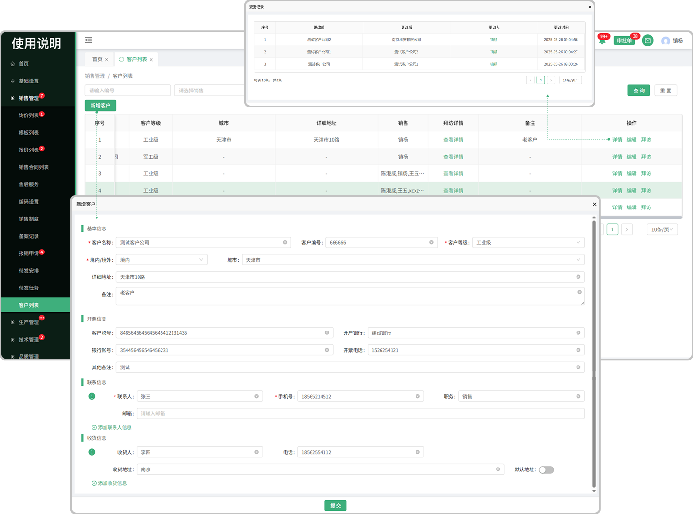

# 客户列表

> "客户列表"位于销售管理板块，在"客户列表"中维护"客户信息" 后,发起报价，合同时，才能选择到这些客户。

> 功能包括：新增客户,支持 ( 编辑 , 拜访 )

#### 1. 客户信息：
* 新增客户:点击 "新增客户"   

   1.首先选择客户名称，客户编号，以及等级以后，填写境内/境外(国内/国外),城市,详细地址
 
   2.开票信息填写客户税号，开户银行，银行账号，开票电话，备注
   
   3.接着添加联系人(可添加多个联系人信息) 

   4.最后填写收货信息，输入收货人，电话，收货地址

  -可添加多个收货地址

  -默认地址开启时收货按这个地址为主

#### 2.详情

* 如果更改了客户名称会在详情中产生更改记录

#### 3.编辑

* 在原有客户信息的基础上进行更改

#### 4.拜访

* 填写拜访人员，预计费用，拜访时间，拜访原因提交即可

  -拜访的记录可在拜访详情中查看，并输写拜访总结

