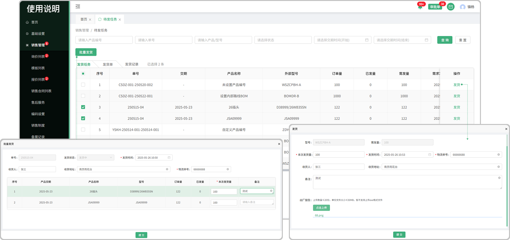

# 待发任务-发货任务

> “待发任务”位于“销售管理板块”包含发货任务，发货单，发货记录，来源：由待发安排中分发下来的任务

#### 1.发货任务

* 由待发安排中主管分发下来的任务

#### 2.发货

* 点击发货按钮进行发货

#### 3.批量发货

* 勾选序号前的勾选框，触发批量发货按钮，点击批量发货按钮可将所勾选的单子批量发货、

* 同一单号的订单才能批量发货

#### 4.已发量

* 可查看已发的数量，发货日期，单位，物流单号，发货人员

# 待发任务-发货单

#### 1.发货单

* 在发货任务中发货完成以后，生成发货单，可在发货单页面进行装箱

#### 2.装箱

* 点击设置图标可编辑包装箱信息
* 点击黄色包装箱图片可查看/编辑装箱量

#### 3.新增包装箱

* 点击新增图标可添加包装箱数量

  -有剩余多的产品可一直添加包装箱的数量，如分配完成，则不可添加，添加按钮消失

# 发货记录

* 在发货任务中所产生的发货记录

* 支持搜索单号，编号，名称，收货人，开始时间，结束时间的查询

