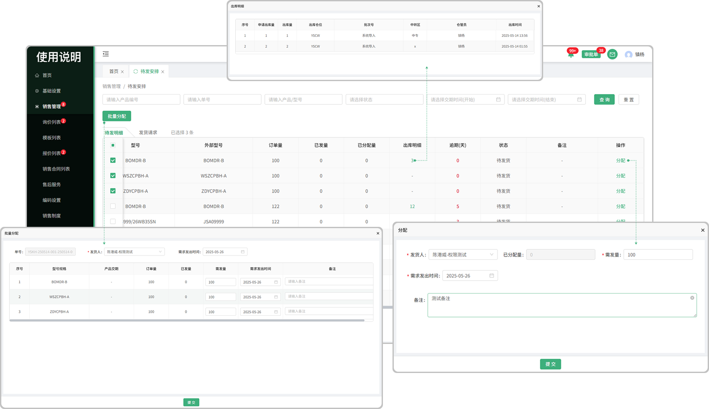

# 待发安排-待发明细
> “待发安排”位于“销售管理板块”包含待发明细、发货请求

#### 1.待发明细来源

* 销售合同签章完成点击开始生产，系统会触发待发任务，在待发任务中产生待发明细

#### 2.分配

* 在待发明细列表中，可以分配员工完成待发任务

* 分配完成的任务会在待发任务列表中显示

#### 3.批量分配

* 勾选序号前的勾选框，触发批量分配按钮，点击批量分配按钮可将所勾选的单子分配给员工

#### 4.已发量

* 分配的单子给员工，员工发货完成提交以后，主管在已发量中可点击查看到员工发货的信息

#### 5.出库明细

* 在出库列表中出库以后会产生出库明细，点击可查看申请出库量，已出库量，出库仓位，批次号，中转区，仓管员，出库时间

# 待发安排-发货请求

#### 1.发货请求来源

* 在销售合同页面点击发货，所发货的单子会流转到待发安排-发货请求这个页面

* 发货请求页面所带气泡提示，提示用户有多少单子未发货

#### 2.分配

* 在待发安排-发货请求中，可分配给员工来完成任务

* 分配完成的任务会在待发任务列表中显示

#### 3.批量分配

* 勾选序号前的勾选框，触发批量分配按钮，点击批量分配按钮可将所勾选的单子分配给员工

#### 4.已发量

* 分配的单子给员工，员工发货完成提交以后，主管在已发量中可点击查看到员工发货的信息

