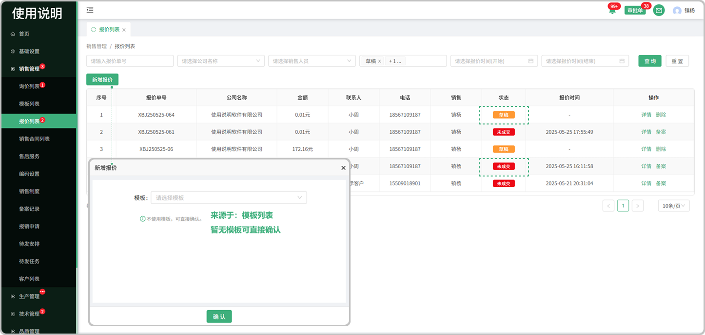

# 报价列表

> "报价列表”位于"销售管理板块，维护报价单数据
#### 1. 新增报价单：
* 生成报价单的方式包括：

    -直接新建, 报价信息由销售人员编辑
  
    -将询价转为报价，报价信息由销售人员编辑

#### 2. 保存草稿功能：

* 编辑过程中，可以将报价单暂存下来， 状态是草稿

#### 3. 存为模板功能：
* 将报价单中，除了产品明细之外的内容，存成模板，供后续使用

#### 4.备案功能
* 点击备案跳出弹窗输入备注提交即可（后续在备案记录页面中查看）

#### 5.确认功能
* 报价单填写完毕后，可以同步发送给客户查看， 状态是未成交， 客户查看报价单的方式包括：

  ）使用系统的客户 ，可以登录自身系统，浏览报价，退回报价，下单

  ）不使用系统的客户，可以登录航舰系统，浏览报价，退回报价，下单

* 客户退回报价后，销售报价单数据状态变为 草稿，销售人员可以继续编辑

* 客户进行下单的情况下，销售人员需要等待客户拟定好采购合同且客户进行签章后，才能查看合同信息。

#### 6.保存功能
* 确认后，客户进行下单或退回操作之前，销售人员可以继续编辑，点击保存，最新的信息会同步给对方

#### 7.转为合同功能
* 客户没时间下单或者客户不想使用系统时，销售人员可以将报价单转为合同，报价单状态变更为已成交 ，销售人员不可以继续编辑报价单，而是 编辑新生成的 销售合同

#### 8. 其余功能

* 需方信息：来源于销售管理,客户列表中添加的客户信息

-显示关联图标的代表这个公司有关联的子公司

* 需方联系人：来源于销售管理,客户列表中添加了联系人
* 语言：可选中文和英文
* 类型：来源于财务管理,汇率税率列表中添加的汇率税率信息
* 等级：来源于财务管理,产品等级列表中添加的产品等级信息
* 选择产品：产品来源于”产品列表“中所添加的产品（可以输入型号创建产品字段）
* 小眼睛图标：指的是页面中在甲乙方列表中的小眼睛图标，默认全展示，可关闭或者打开（如果关闭对方将无法看到这条信息，包括打印和下载都不展示）
* 批量导入：可批量导入产品（先下载模板Excel进行编辑导入即可）
* 使用提示：点击使用提示可弹出弹窗，在弹窗中显示动图，可切换查看对应功能的使用（新增字段、批量修改价格、调整宽度、签章显示、签章不显示）
* 历史报价：跟这个公司销售过这个产品，如果再次报价就会有之前的报价信息
* 历史成交价：跟这个公司销售过这个产品,成功了以后再次销售会有之前的历史成交价
* 单价/总计小数点位数显示：根据报价类型设置的小数位数显示小数位

  -（例如：报价类型设置的小数位数是2位，产品列表中单价，总价显示的金额位数是两位）

  -（报价类型设置的小数位数是4位，产品列表中单价，总价显示的金额位数是4位）
* 总计：是所添加的产品单价的总计(支持更改单价添加公式(加 , 减 , 乘(乘的是百分比也就是0.01) 输入数值)
* 字段更改：在添加产品信息以后可以悬浮对应的产品信息如果出现"更改的图标"就代表可以更改这个产品内容的信息,或者出现时双击也可以更改
* 抄送：下方文本框内所填写的信息会发送给所勾选的抄送对象

