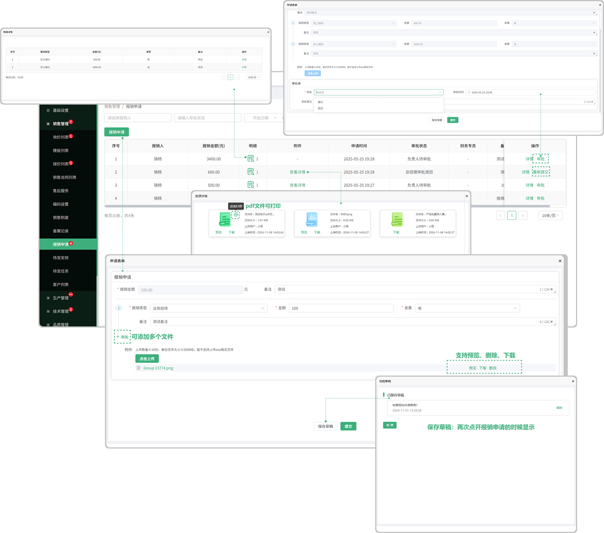

# 报销申请

> "报销申请"位于销售管理板块，在页面中申请的报销信息需要得到审批，如果审批不通过需重新发起
#### 1. 如图所示：报销申请

* 审批：分为负责人审批（在填写报销申请时填写的报销人）、总经理审批
* 审批人：审批人有审批的权限才可以审批，审批的权限在基础设置的 “ 流程权限管理” 中添加
* 重新发起：如果负责人或者总经理审批的时候没有通过，则需要重新发起
* 点击上传：在报销申请中可以点击上传附件，上传数量不能大于10份，单份的文件大小≤500MB，暂不支持上传exe格式文件
* 草稿箱：保存草稿箱在新增报销申请的时候会显示保存的草稿

