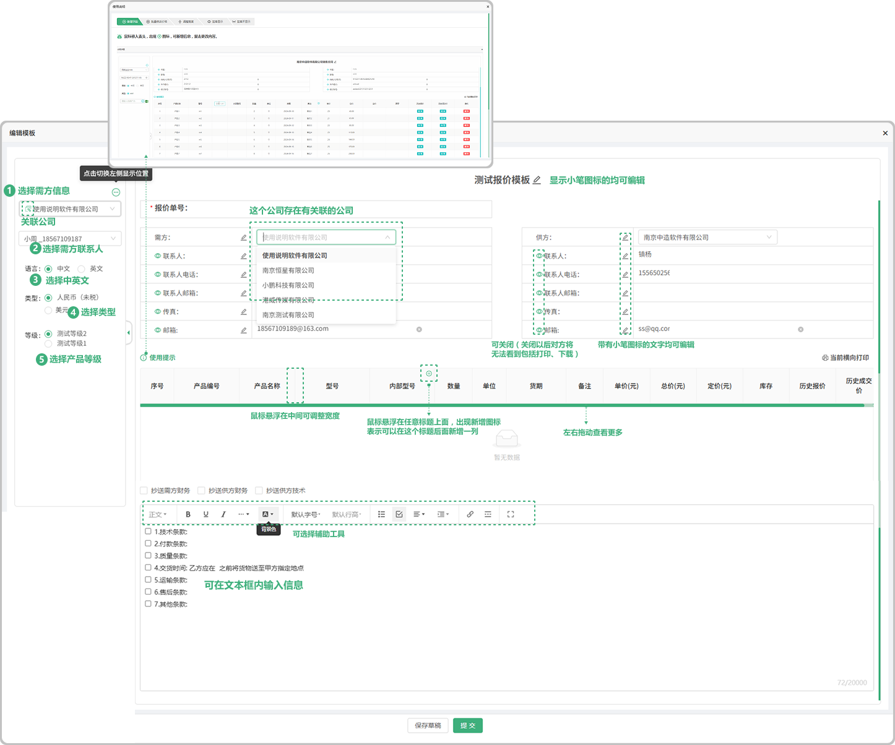
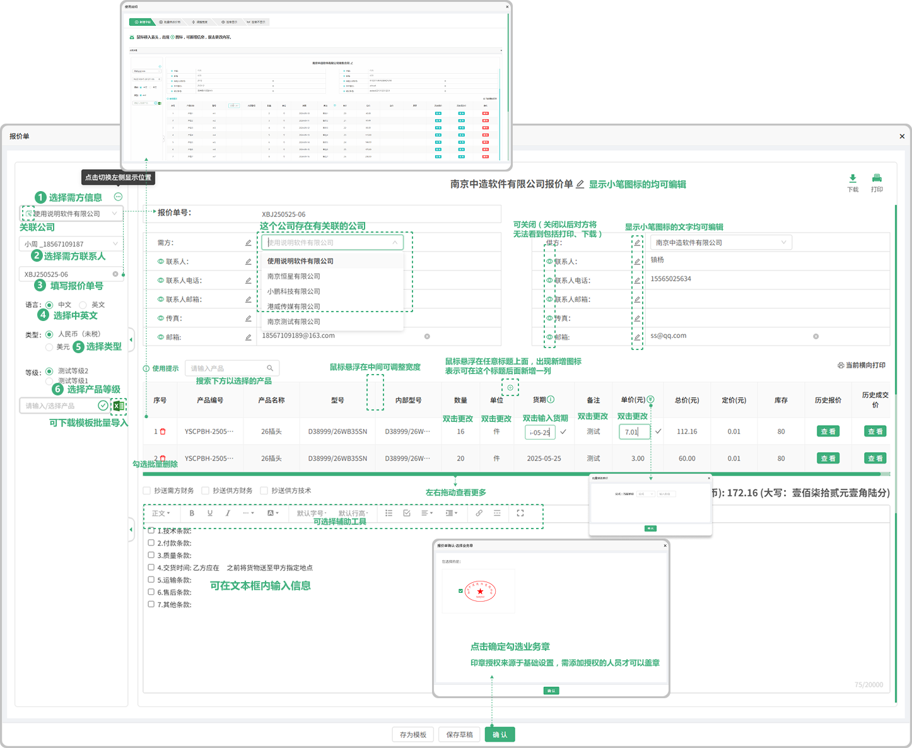
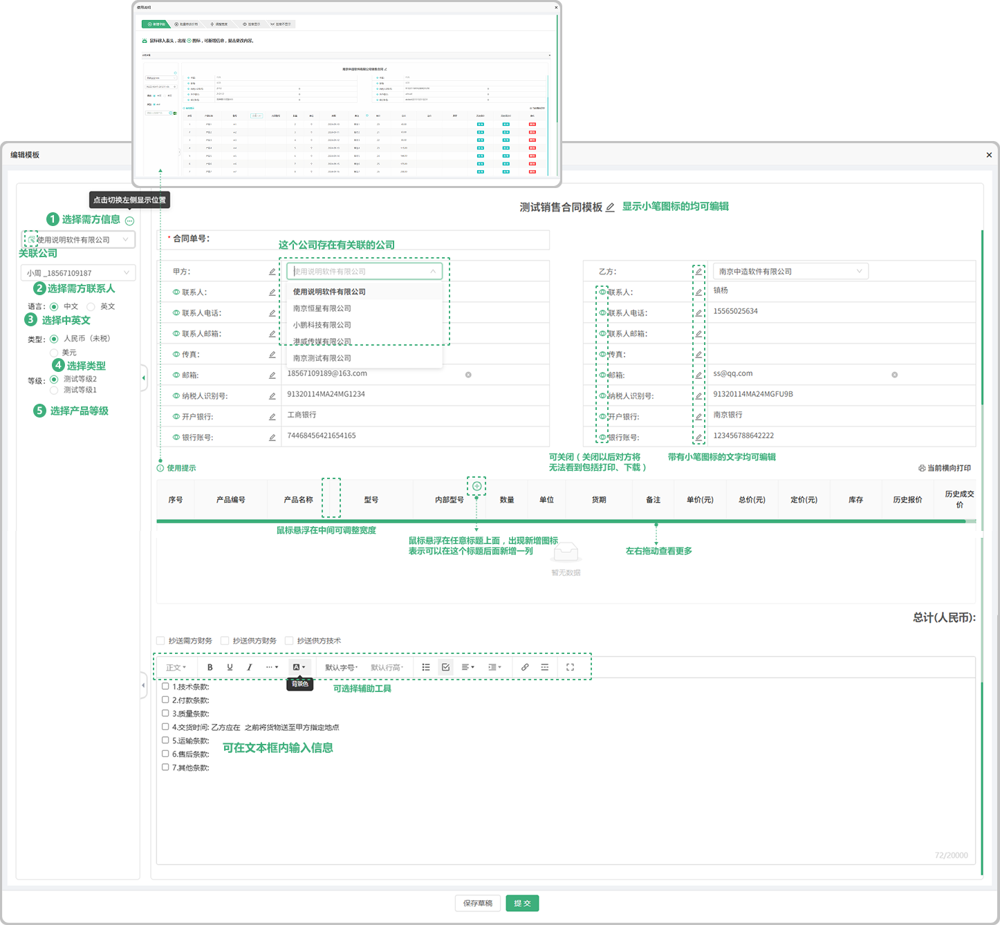

# 模板列表

> "模板列表"销售管理板块，可以维护个人的 "销售合同模板" "销售报价模板"
> 
> 经常使用的报价信息，合同信息，可以维护成模板，方便地根据模板创建报价单，合同。

#### 1. 新增模板：
* 输入模板的名称,选择模板的类型(分为两种:销售报价和销售合同),填写排序值(排序值是指输入的数字越大,显示和选择时就越靠前
* 模板状态：分为可用(在编辑完提交以后) ,草稿(编辑完模板没有提交而是保存草稿)
* 草稿->可用：点击草稿后面的 "详情" 打开文件进行提交就转换为 "可用" 状态了

#### 2. 销售报价单模板

> "可以选择客户、客户联系人、语言、类型、等级、支持修改需方，鼠标悬浮在产品信息表格添加新的"字段",双击编辑字段名称),新加字段支持"删除","添加" 表格标题右侧可拖动调整列宽,拖动下方滚动条可查看更多信息,可添加条款内容,选择抄送对象,输入条款内容(支持 编辑,添加,删除)

* 需方信息：来源于销售管理,客户列表中添加的客户信息
* 需方联系人：销售管理,来源于客户列表中添加了联系人(可添加多个联系人)
* 语言：可选中文和英文
* 类型：来源于财务管理,汇率税率列表中添加的汇率税率信息
* 等级：来源于财务管理,产品等级列表中添加的产品等级信息

#### 3. 根据报价模板，新增报价

> "根据报价模板可直接生成报价单

* 需方信息：来源于销售管理,客户列表中添加的客户信息
* 需方联系人：销售管理,来源于客户列表中添加了联系人(可添加多个联系人)
* 语言：可选中文和英文
* 类型：来源于财务管理,汇率税率列表中添加的汇率税率信息
* 等级：来源于财务管理,产品等级列表中添加的产品等级信息
* 选择产品：产品来源于产品列表中所添加的产品（可以输入型号创建产品字段）
* 批量导入：可批量导入产品（先下载模板Excel进行编辑导入即可）
* 历史报价：跟这个公司销售过这个产品，如果再次报价就会有之前的报价信息
* 历史成交价：跟这个公司销售过这个产品,成功了以后再次销售会有之前的历史成交价
* 总计：是所添加的产品单价的总计(支持更改单价添加公式(加 , 减 , 乘(乘的是百分比也就是0.01) 输入数值)
* 字段更改：在添加产品信息以后可以悬浮对应的产品信息如果出现"更改的图标"就代表可以更改这个产品内容的信息,或者出现时双击也可以更改
* 存为模板：如果点击存为模板在模板中展示所存的模板
* 确认：如果点击确认在选择业务章确认以后,在报价列表显示状态"未成交",需备案处理
* 保存草稿：点击保存草稿,在报价列表显示状态为 "草稿"

#### 4. 销售合同单模板

> "可以选择客户、客户联系人、语言、类型、等级、支持修改需方，鼠标悬浮在产品信息表格添加新的"字段",双击编辑字段名称),新加字段支持"删除","添加" 表格标题右侧可拖动调整列宽,拖动下方滚动条可查看更多信息,可添加条款内容,选择抄送对象,输入条款内容(支持 编辑,添加,删除)

* 需方信息：来源于销售管理,客户列表中添加的客户信息
* 需方联系人：销售管理,来源于客户列表中添加了联系人(可添加多个联系人)
* 语言：可选中文和英文
* 类型：来源于财务管理,汇率税率列表中添加的汇率税率信息
* 等级：来源于财务管理,产品等级列表中添加的产品等级信息

#### 5.  根据合同模板，新增合同

> 根据合同模板可直接生成报价单

* 需方信息：来源于销售管理,客户列表中添加的客户信息
* 需方联系人：销售管理,来源于客户列表中添加了联系人(可添加多个联系人)
* 语言：可选中文和英文
* 类型：来源于财务管理,汇率税率列表中添加的汇率税率信息
* 等级：来源于财务管理,产品等级列表中添加的产品等级信息
* 选择产品：产品来源于产品列表中所添加的产品（可以输入型号创建产品字段）
* 批量导入：可批量导入产品（先下载模板Excel进行编辑导入即可）
* 历史报价：跟这个公司销售过这个产品，如果再次报价就会有之前的报价信息
* 历史成交价：跟这个公司销售过这个产品,成功了以后再次销售会有之前的历史成交价
* 总计：是所添加的产品单价的总计(支持更改单价添加公式(加 , 减 , 乘(乘的是百分比也就是0.01) 输入数值)
* 字段更改：在添加产品信息后可以悬浮对应的产品信息如果出现"更改的图标"就代表可以更改这个产品内容的信息,或者出现时双击也可以更改
* 交货时间：位于合同的条款下面，双击 在乙方“____”之前......
* 存为模板：如果点击存为模板在模板列表中展示所存的模板
* 签章：如果点击签章在选择合同章确认后,在合同列表显示，可开始生产（签章之前需填写交货时间）
* 保存：点击保存,在合同列表显示状态为 "未签章"，点击详情可进去签章

