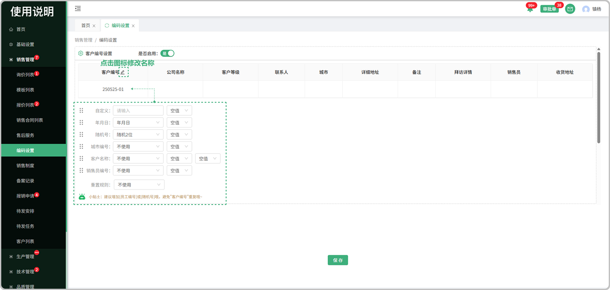
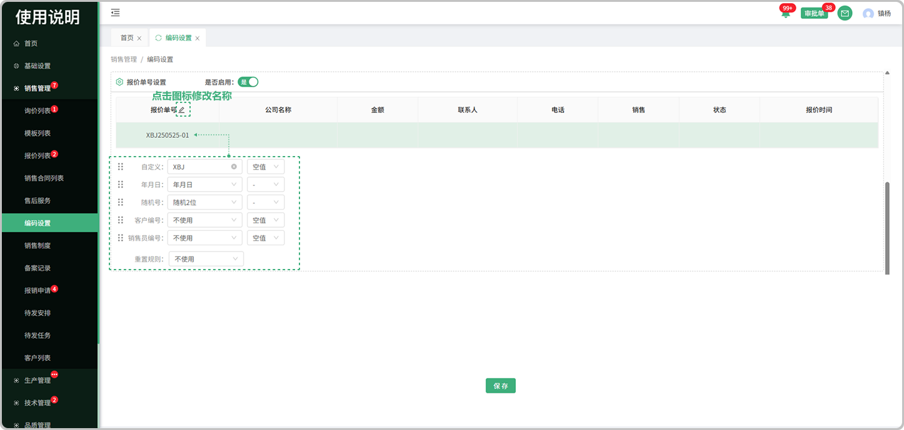
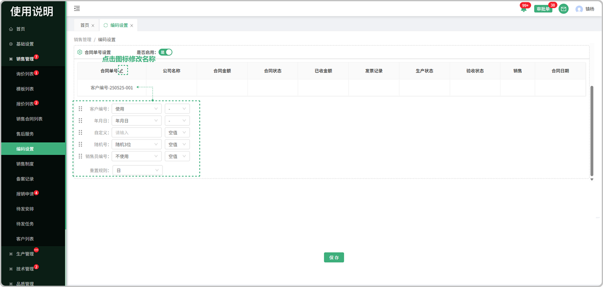

# 编码设置

> "编码设置"位于销售管理板块，可在编码设置中维护，客户编号，报价单号，合同单号，支持更改编号/单号名称

#### 1. 客户编号
* 是否启用：是代表使用，否代表不使用

* 编号名称：点击修改图标可修改客户编号名称

* 预览：所设置的客户编号可在表头中预览

* 编号设置：分为自定义，年月日，随机号，城市编号，客户名称，销售员编号，同时可选择符号带入

* 重置规则：分为日，月，年，不使用，列：选择了日，就代表一日后重置，年就是一年，不使用就是永久

#### 2.报价单号

* 是否启用：是代表使用，否代表不使用

* 编号名称：点击修改图标可修改报价单号名称

* 预览：所设置的报价单号可在表头中预览

* 编号设置：分为自定义，年月日，随机号，客户编号，销售员编号，同时可选择符号带入

* 重置规则：分为日，月，年，不使用，列：选择了日，就代表一日后重置，年就是一年，不使用就是永久

#### 3. 合同单号

* 是否启用：是代表使用，否代表不使用

* 编号名称：点击修改图标可修改合同单号名称

* 预览：所设置的合同单号可在表头中预览

* 编号设置：分为客户编号，年月日，自定义，随机号，销售员编号，同时可选择符号带入

* 重置规则：分为日，月，年，不使用，列：选择了日，就代表一日后重置，年就是一年，不使用就是永久

