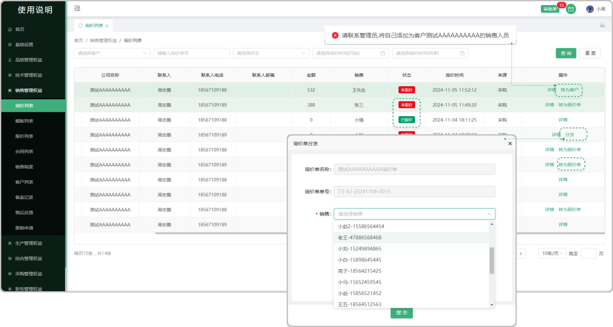

# 询价列表

> "询价列表”位于"销售管理板块，处理 官网询价或 客户询价。功能包括：删除、分发、转为客户、转为报价单；状态分为 未报价、已报价

#### 1. 分发：
* 分发：超级用户/管理员将未指定接收询价的销售人员的询价数据，分发给某个销售

#### 2. 转为客户：
* 当显示转为客户时，说明对方还不是我们的客户，需要先转换为我们的客户，方便后续与该客户进行交互

* 如果点击出现请联系管理员，将自己添加为客户XXXXX的销售人员时，需要管理员去到销售部的 “客户列表” 中找到相对应的公司，点击更多中的 “变更” 在销售里面添加销售人员提交即可

#### 3. 转为报价单：
* 将询价转为报价，避免手动再次创建报价单。

* 点击转为报价单以后弹出报价弹窗，点击确认即可

#### 4. 删除询价功能：
* 任意访客用户可以在企业官网留言进行询价，对于其中的无效询价，超级用户/管理员可以进行删除